# 工作日志
> ## 7-15
> * 今天修复了0710版本中的时间错位的问题，以及一维卷积的维数错位问题
并且修改了几个小问题

> ## 7-16
> * 忽略了空间维度上的前后关系，需要进行添加，同时可以考虑model模型中测试和训练的
部分开，同时去掉裸数据与lstm层之间的全连接层，感觉没什么用

> ## 7-17
> * 空间上的联系就先简单的设置成前一个节点的输出就是后一个节点的输入，这一点也
时可以理解的，因为每一个节点的输出都是综合考虑了前后节点状态而做出的
现在的问题有两点：  
> > 1.pytorch内对变量的局部修改会导致梯度回传出现问题，这一点需要想办法解决  
> > 2.损失的计算，这里需要对输入输出做一些变动，输入变成只有第一个节点，也就是  
> * 只有整个路段的输入，这里需要考虑是不是对状态进行初始化这里的二维数据延展比较复杂，所以先写一个这个二维输入网络中的cell

> ## 7-19
> * 今天写完了二维网络的训练部分，现在觉得模型的专门测试函数有点不太合适，可以把预测阶段前的输入都作为模型的输入，而不是只有时间和空间的两个初始输入这部分明天改改,然后把测试的部分加进去，检测一下没有时序错位的问题就开始训练
> * 17号的两个问题：
> > 1.引用局部变量是可以的，但是对变量内部局部修改是不可以的会造成梯度回传的时候找不到对应的链式项  

> > 2.现在采用的输入方式是: 训练过程中，forward函数里输入的是$spatial\times temporal \times input\_size$的张量。每一时刻都以真实采集数据为输入；测试过程中， infer函数里输入的是一个$spatial \times input\_size$的空间初始输入与$(temporal-1) \times input\_size$的时间初始输入  

> > 3.另外，对损失函数做了修改，除了单纯的均方误差还有：时间上的误差，是指当前格子流入加上存量减去流出与输出中的下一时刻的存量是否相等；空间上的误差，是指当前格子接下来一段时间的输出量与下一个格子接下来一段时间的流入量是否相等
 
>  > 手绘一个网络图是这样的
>  > 
> * 另外在流体文献的阅读方面，最基础的流体方程是Navier-Stokes方程，这是一种描述粘性流体的偏微分方程，来源于传统的牛顿力学，目前看到的一些流体交通的方法都是源自于对它的不同项进行修改使得可以描述基于各种围观车辆行为的流体表现，这一点可以继续看一看，但是总觉得对这个模型帮助不大

> ## 7-20
> * 今天想到我们把每个block切分的很小的时候是不是就意味着整体序列的长度可以变短了，更久远的输入不会对现再的输出产生明显的影响所以这个地方可以减少一些。
> * 写了测试代码，可以先跑一下看看有没有什么bug明天改

> ## 7-22
>  * 测试总是出现各种小问题，现在进度有点慢，不过可以先做一部分新的数据出来，用额外的这台主机跑一部分出来

> ## 7-23
> * 阅读经典流体相关文献阶段小结，连续流体的描述主要取决于速度场和密度场，另外流体的运动性质也与流体本身的粘性系数和外界压力等相关，但是由于我们模型中的输入及其有限——只有几个有限界面的离散的累积量。将连续流体方程扩展到离散领域的就变成最简单的流入等于流出量这样的基本约束，目前没有找到更加复杂的约束条件。
> * 另外，关于流体约束的一个思考是，我们的模型就是用于学习一个近似流体的输出，其中当然包括有诸如粘性系数，压力等等相关的作用产生的影响，所以不知道是不是需要添加更复杂的约束。目前可以添加的约束有：
> > $$I_{s,t} + N_{s,t-1} - O_{s,t} = N_{s,t}$$
> > $$O_{s,t} = I_{s+1,t}$$
> * 上述的约束在训练过程中可以通过在最后的损失函数中加入额外的损失项进行也就是说：
> > $$L=l(o_{s_t}, \hat{o_{s,t}})+l(N_{s,t} - N{s,t-1}, I_{s,t},\hat{o}_{s,t})$$
> * 目前完成了对原有代码的部分修改可以进行训练，另外可能需要再做一部分数据，新分配的主机读取文件还是有点吃力，可能需要拆成一个一个的路段，明天需要重新跑一下看看

> ## 7-24
> * 训练测试的部分还是有bug， 不过根据程序bug之前给的输出，测试的效果差距很大，需要先把bug找到然后在考虑对模型训练过程中的修改
> > 
> * 另外今天统计了一下广西路网中的各种路段的比例，从数量来看绝大多数是500米以下的散碎路段，但是如果从占整体路网长度的比例来看，大概75%左右的长度都是由500米以上的路段构成，85%以上都是由300米以上的路段构成；在车道数方面，几乎没有3车道以上的路段，所以接下来应该着手用sumo生成一批长度在300米以上的单车道或者双车道场景下的数据。
> > 按数量统计  
> > 
> > 按长度占比统计  
> > 
> * 代码有bug大概是在test数据中大于5500之后的500个batch出现的，明天需要继续定位找到数据的问题

> ## 7-25
> * 找到了问题，是因为之想固定每个模型对象所表达的长度，但是在测试数据中并没有做长度相关的限制所以出现了问题，另外发现了之前有一些拼接错位的问题也进行了修改
> * 另外和毛老师讨论之后需要增加一些具体路网的模型对象，例如红绿灯路口，两段模型的拼接，超短路段，超长路段，这部分可以通过设置新的路网模块对象来进行处理
> * 30号放假离所之前先考虑一下每一个batch内部增加路段的训练，现在每一个batch内只有一个路段，训练稍微有点慢，改的思路是这样：
> > 1.~~utils这部分先不动，因为这部分没有并行化的接口，在内部循环和在外部循环是一样的，这里可能需要把一些之前旧的代码删掉~~ 发现还是要修改一下utils的代码，不然在训练部分的代码不好处理   
> > 2.需要修改模型内部代码使之可以处理一个batch内多个路段的情形，这部分是重点  
> > 3.修改训练过程中的代码需要修改，通过循环生成每个batch内部多个路段的数据  
> * 接下来需要从1开始逐步修改
> * 到晚上八点半基本改完，整个程序可以完整运行，但是中间发现之前的好多问题，明天可能需要仔细检查一下，添加一下注释，也方便之后修改

> ## 7-26
> * 今天上午了一下model与train部分的代码：
> > 1.添加了模型部分的注释
> > 2.发现原来的lane gate部分没有添加sigmiod函数，做了增加
> > 3.理清了测试部分的时序关系，修复了之前的错位问题
> > 4.修改了之前没有发现的使用gpu时的问题
> > 5.修改了由于一个batch内有不同路段造成的不能将生成的数据转成tensor的问题
> * 一个值得记一下的点，pytorch中矩阵变形的操作耗时极小，所以在模型中调整tensor形状的操作一般不会成为瓶颈。这也很好理解，因为矩阵的变形操作只需要将索引对应的乘数改变就可以
> * 还是有bug……不过今天不想改了，让服务器显示着一些运算信息明天来改好了
> * 接下来是局部交通路网的模型，今天先定义一个：
> > 超长的路段
> > > * 长度上要求应该要有至少两个到三个2000米路段拼接起来的长度，也就是2000-6000米左右， 拆成几个路段，长度的选取应该通过实验确定  
> > > * 数据输入方面，基础的对比数据是实际仿真采集到的数据，采集部分的代码应该和之前的一样，这部分需要做一部分新数据出来
> > > * 仿真方面，输入的数据是第一段的第一个节点按时刻的输入，然后需要确定一下不同段之间的连接方式，需要通过一定方式对连接的部分进行控制
> > > * 这里可以对比一下在极限长度下的模型效果，然后对比一下看看模型的误差在什么程度上
> * 之后是比较轻松的生成数据阶段，要做一些超长路段的数据，然后做一些双向相位的红绿灯路口数据。

> ## 8-2
> * 高温假来无锡填报告的间隙看了一眼训练结果是这样：
> > 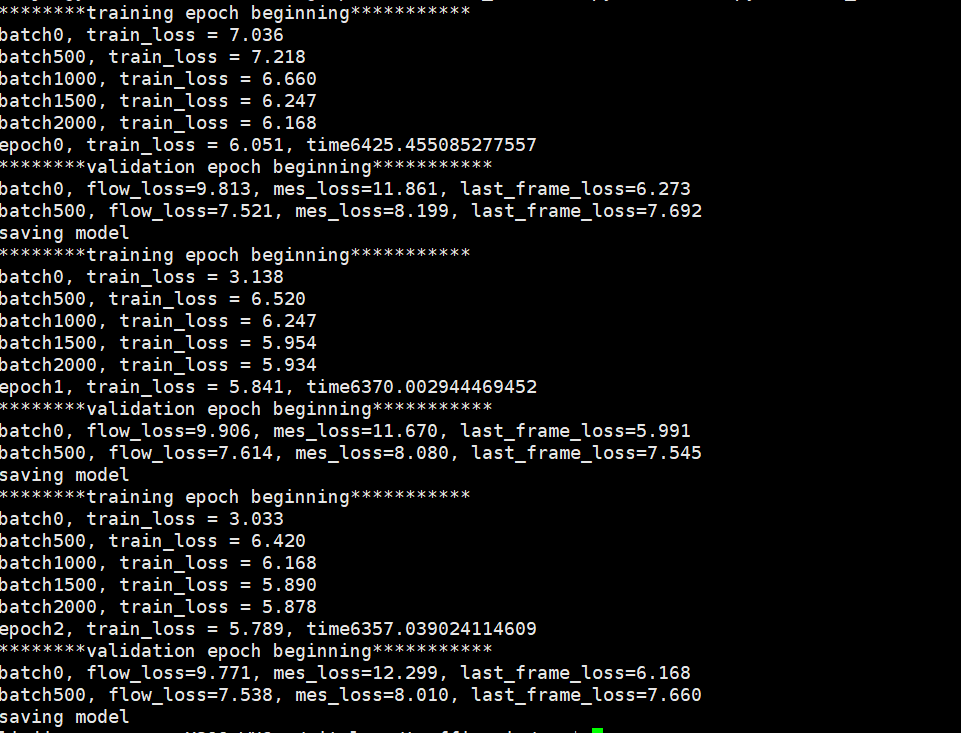
> * 这几天在无锡不一定有时间，回家之后的假期调整一下训练参数，另外检查一下结果有没有问题

> ## 8-10
> * 今天调整了中间隐层状态重新训练一下，之前的训练结果说明至少在20个epoch的情况下，训练误差与测试误差在同步的减少，不过训练的速度有点缓慢，gpu利用率不高，这里需要后期做一个性能测试，查看一下性能瓶颈在哪里，训练的结果是这样的
> > 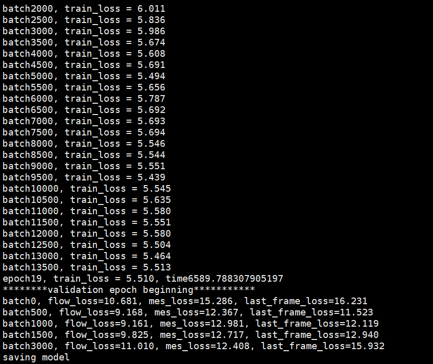
> * 这里一对比发现不太对劲……比上次的测试误差大很多是不是因为大batch的原因可以看一下这次的训练结果再做评价

> ## 8-17
> * 今天回所了，开始重新调整一下batch size看一下是不是会更好，另外接下来需要做的事情有两件：
> > * 性能测试，需要分析一下训练过程中的时间的占比，看一看是不是可以让整个训练测试阶段的速度变得更快
> > * 继续完成超长路段的类，这里需要主要明确的两点问题是：1 长路段怎么拆成短路段 2 相邻短路段之间的衔接是如何进行的
> * 测试结果和预想的相似，大部分时间消耗在生成数据上面，生成样本消耗时间比其余操作中最慢的梯度clip操作要高出两个数量级，所以现在如果希望性能得到提升需要对数据生成部分的代码做出修改
> * 这里需要先对生成样本部分的代码做出修改，不然会后期生成超长路段的部分也需要大修改
> * 下午17:21修改的过后的代码速度对比是这样：
> > 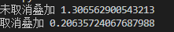
> * 有六倍左右的加速，并不是特别满意，需要考虑一下是不是需要进一步调整样本组织方式
> * 调整了一下采集方式速度快了30%左右，减少到0.13左右，查看了一下在训练中的耗时已经不是瓶颈了：
> > 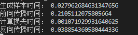
> * 直接在新作的数据上开始应用好了

> ## 8-20
> * 折腾了好久终于开始测试了，开始第一次训练：
> > batch_size 30 num_epochs 10 训练长度为300-800米路段 其余都是defualt取值   #8-20-20:45 具体在8-20文件夹内
> > 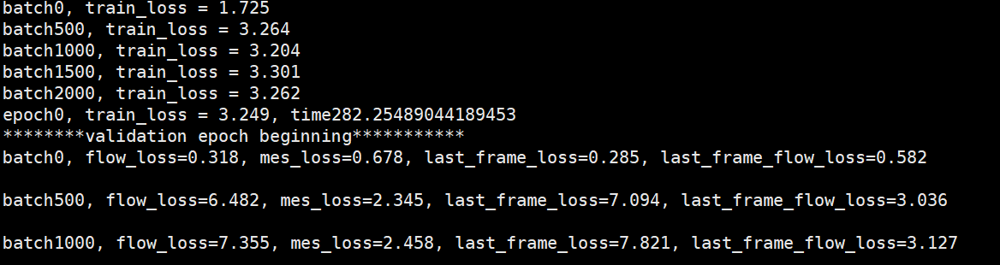

> * 另外今天写了一下添加一个embedding层的网络，明天需要看一下能不能正常训练

> ## 8-21
> * 另外几轮训练的结果在8-20 8-21 8-21-1这三个文件夹下，整体上只调整了batchsize，结果上看均方误差明显大于流量误差，接下来调整一下flow_loss_weight这个参数看一看是不是会有更好的结果
> * 增加了embedding层的网络训练测试都可以了，可以根据情况做一下实验看看结果怎么样
> * 发现两个无比低级的错误，一个是在infer函数里没有在最后的输出里加上lane_controller的影响；第二个是在输出显示里把flow的平均损失和绝对的均方误差的显示弄反了，怪不得显示的最后一帧的flow损失总比平均的小很多
> * 从现在的情况看一个路段中不同位置的bucket的准确情况好像不太相同，在这里专门写一个test的文件用来做全方位的测试，测试这个模型在时序上和空间位置上的准确性 

> ## 8-22
> * 调整参数造成的改变很有限，不过还没有尝试对序列长度和embedding层做实验，目前实验的一个可视化效果是这样：
> > 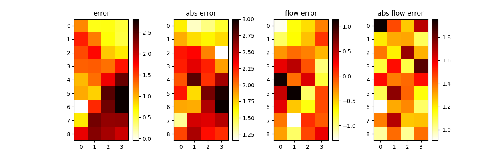
> > 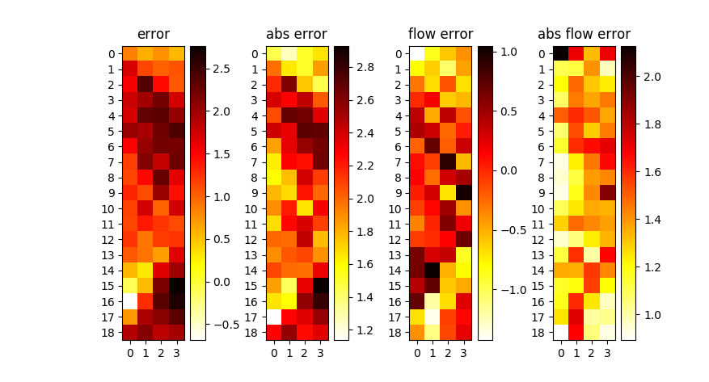
> > 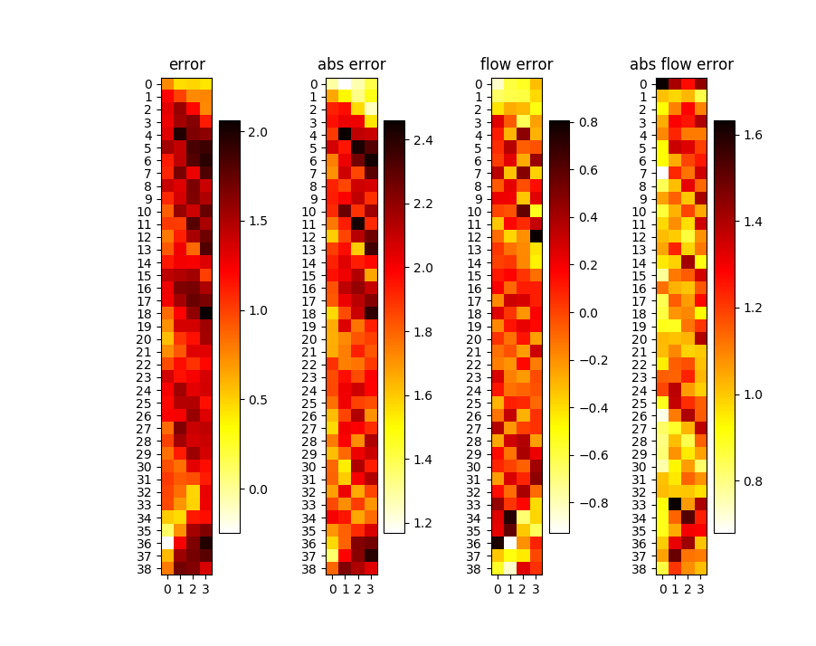
> * 需要注意的几点关键的地方在：
> > * 路段开始与路段结束的地方预测的效果偏差
> > * 整体预测值偏小
> > * 在长路段中表现竟然比训练路段还要好，这个目前没有头绪是为什么
> > * 模型的误差在时间上向后增加，在空间上向后传递
> > * 检测了一下不采用infer模式可以得到结果：
> > 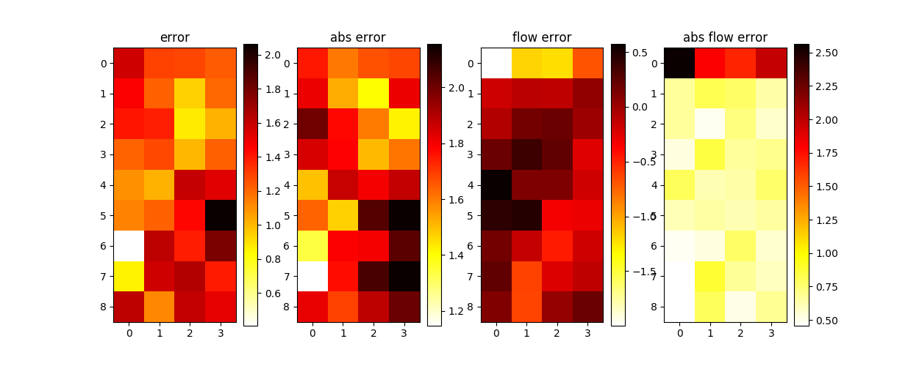
> > 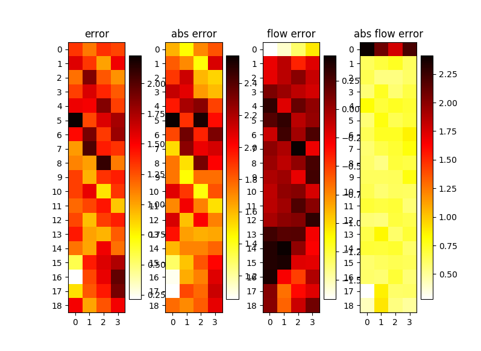
> > 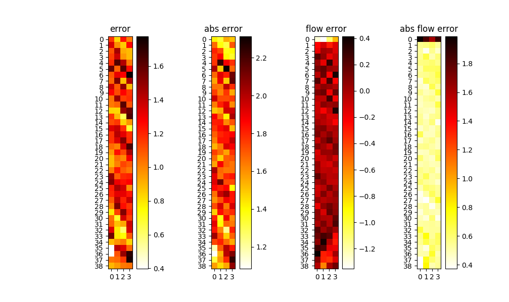
> > * 不采用infer模式会更加准确一些，flow_loss也会减到很少，但是整体的预测值还是偏少，路段两端不再是误差严重累积的地方
> * 突然发现这个数据有问题……，在生成bucketid的时候长度的输入弄错了结果少了最后一个bucket的，这个地方需要重新做一下数据重新训练……真的是头疼，自己从头写一个框架都是到处是洞，防不胜防
> * 又一个错……train.py文件里默认的delta T没有改，还是7所以选的时间间隔都不太对，一个头两个大，重新训练测试一下看看结果怎么样
> * 我是小糊涂，传错文件了，从头来吧脑壳疼

> ## 8-23
> * 今天和毛老师讨论了一下，有以下这么几个要做的事情
> > * 整体预测值偏少可能因为在高流量情况下整体的方差会比较大，但是在低流量的情况下方差会比较小，所以整体上来说，预测倾向于向小值预测这部分可以通过在损失的地方除一个与流量相关的量，类似于$loss = \frac{loss}{flow+\epsilon}$之类的方法
> > * 整体预测值偏小的情况可能有误差累积的问题，所以在之后的情况下我们需要进行单帧的预测，然后分析预测与实际之间的偏差分布
> > * 关于隐层状态的问题，现在观察流量最大值的时候注意到，大部分输出超不过当前存量，而且当前bucket的流出量与前面bucket的状态关系可能不太大
> * 昨天训练着看感觉加不加embedding没啥卵用，删掉这部分代码
> * 脑壳疼……原来是代码bug，forward函数里也没加lane_controller的影响

> ## 8-24
> * 今天出去玩了一白天，半价烧烤真香。回来看了一下训练结果也不好，可能是因为加了超长路段数据的原因？这一批训练完了就尝试一下去掉超长路段，还是原来一样300-800米，可能影响也不会很大

> ## 8-26
> * 周末调整了lane_controller的影响发现结果还是很奇怪，目标值都偏小，而且越大的小的越多.
> * 训练条件是50个epoch，每个batch大小为20，整个结果可视化出来大概是这个样子的:
> > 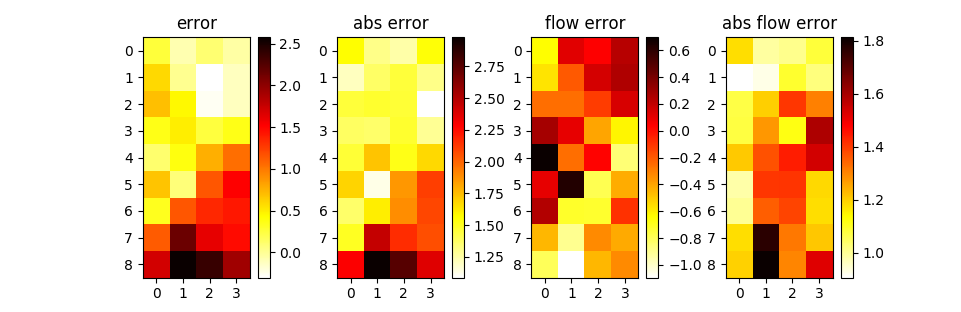
> > 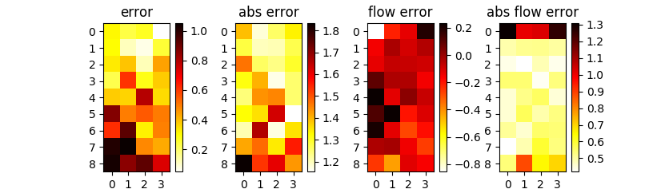
> > 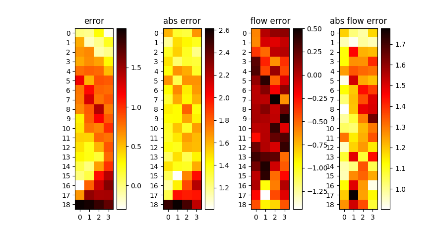
> > 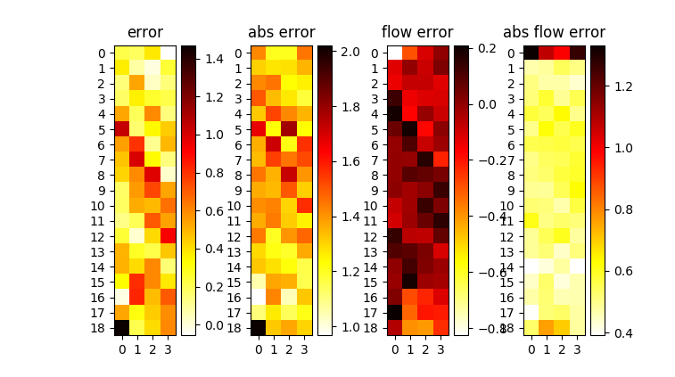
> > 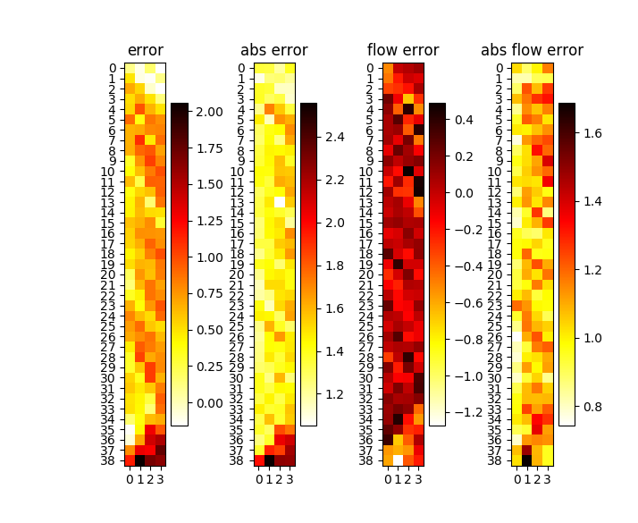
> > 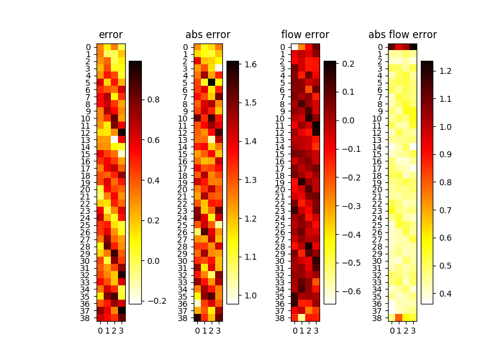
> * 总结一下，目前的baseline的问题有：
> > * 偏小！偏小！整体目前的残差均值还是多数大于0
> > * 路段尾端的输出严重偏差
> > * 推演的结果比训练的结果差很多
> > * 流量守恒，但是绝对平均误差差很多
> * 后面可以采用的方法有：
> > * 改损失函数，控制高流量下偏差较大的影响
> > * 改损失函数，增加靠近路段两端的损失权重
> > * 减少flow loss在损失函数中的权重，增大mes loss的权重
> > * 调整md_lstm cell内部的结构，不过这一个感觉在baseline效果达到一定程度以后才有意义
> * 网络结构中去掉lanegate目前训练的结果较好一些
> * 更换了数据得到了一个比原本结果更极端的一个模型结果，有一点新的东西需要注意：
> > 现在出现问题的主要集中在最后一个小段，而且误差比较集中在第一个时间段，
> > 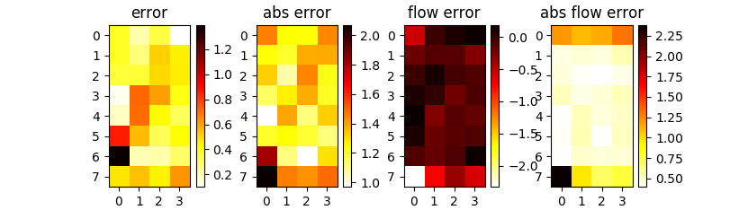
> > 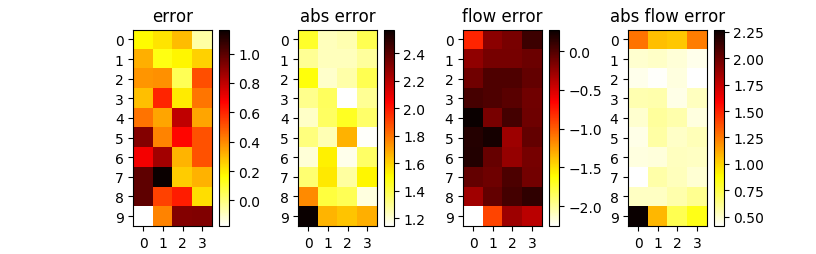
> > 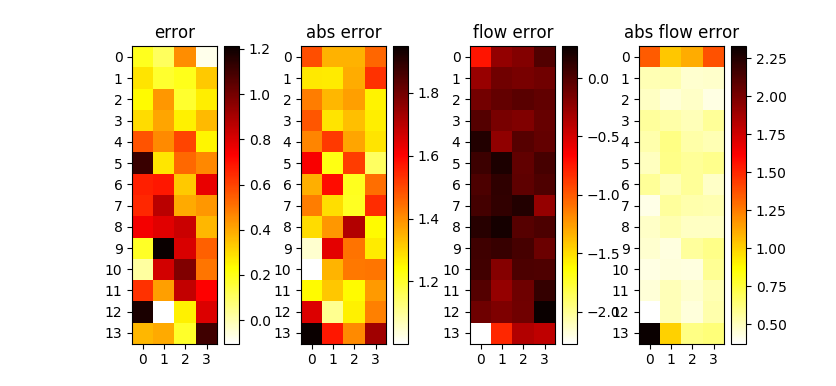