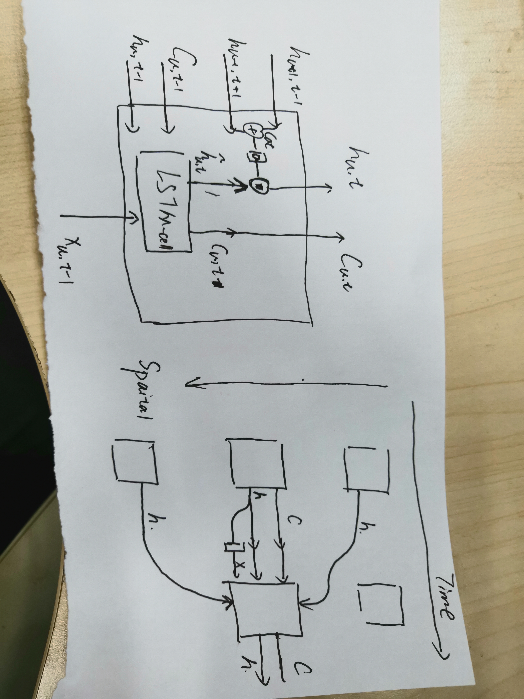

# 工作日志
> ## 7-15
> * 今天修复了0710版本中的时间错位的问题，以及一维卷积的维数错位问题
并且修改了几个小问题

> ## 7-16
> * 忽略了空间维度上的前后关系，需要进行添加，同时可以考虑model模型中测试和训练的
部分开，同时去掉裸数据与lstm层之间的全连接层，感觉没什么用

> ## 7-17
> * 空间上的联系就先简单的设置成前一个节点的输出就是后一个节点的输入，这一点也
时可以理解的，因为每一个节点的输出都是综合考虑了前后节点状态而做出的
现在的问题有两点：  
> > 1.pytorch内对变量的局部修改会导致梯度回传出现问题，这一点需要想办法解决  
> > 2.损失的计算，这里需要对输入输出做一些变动，输入变成只有第一个节点，也就是  
> * 只有整个路段的输入，这里需要考虑是不是对状态进行初始化这里的二维数据延展比较复杂，所以先写一个这个二维输入网络中的cell

> ## 7-19
> * 今天写完了二维网络的训练部分，现在觉得模型的专门测试函数有点不太合适，可以把预测阶段前的输入都作为模型的输入，而不是只有时间和空间的两个初始输入这部分明天改改,然后把测试的部分加进去，检测一下没有时序错位的问题就开始训练
> * 17号的两个问题：
> > 1.引用局部变量是可以的，但是对变量内部局部修改是不可以的会造成梯度回传的时候找不到对应的链式项  

> > 2.现在采用的输入方式是: 训练过程中，forward函数里输入的是$spatial\times temporal \times input\_size$的张量。每一时刻都以真实采集数据为输入；测试过程中， infer函数里输入的是一个$spatial \times input\_size$的空间初始输入与$(temporal-1) \times input\_size$的时间初始输入  

> > 3.另外，对损失函数做了修改，除了单纯的均方误差还有：时间上的误差，是指当前格子流入加上存量减去流出与输出中的下一时刻的存量是否相等；空间上的误差，是指当前格子接下来一段时间的输出量与下一个格子接下来一段时间的流入量是否相等
 
>  > 手绘一个网络图是这样的
>  > 
> * 另外在流体文献的阅读方面，最基础的流体方程是Navier-Stokes方程，这是一种描述粘性流体的偏微分方程，来源于传统的牛顿力学，目前看到的一些流体交通的方法都是源自于对它的不同项进行修改使得可以描述基于各种围观车辆行为的流体表现，这一点可以继续看一看，但是总觉得对这个模型帮助不大

> ## 7-20
> * 今天想到我们把每个block切分的很小的时候是不是就意味着整体序列的长度可以变短了，更久远的输入不会对现再的输出产生明显的影响所以这个地方可以减少一些。
> * 写了测试代码，可以先跑一下看看有没有什么bug明天改

> ## 7-22
>  * 测试总是出现各种小问题，现在进度有点慢，不过可以先做一部分新的数据出来，用额外的这台主机跑一部分出来

> ## 7-23
> * 阅读经典流体相关文献阶段小结，连续流体的描述主要取决于速度场和密度场，另外流体的运动性质也与流体本身的粘性系数和外界压力等相关，但是由于我们模型中的输入及其有限——只有几个有限界面的离散的累积量。将连续流体方程扩展到离散领域的就变成最简单的流入等于流出量这样的基本约束，目前没有找到更加复杂的约束条件。
> * 另外，关于流体约束的一个思考是，我们的模型就是用于学习一个近似流体的输出，其中当然包括有诸如粘性系数，压力等等相关的作用产生的影响，所以不知道是不是需要添加更复杂的约束。目前可以添加的约束有：
> > $$I_{s,t} + N_{s,t-1} - O_{s,t} = N_{s,t}$$
> > $$O_{s,t} = I_{s+1,t}$$
> * 上述的约束在训练过程中可以通过在最后的损失函数中加入额外的损失项进行也就是说：
> > $$L=l(o_{s_t}, \hat{o_{s,t}})+l(N_{s,t} - N{s,t-1}, I_{s,t},\hat{o}_{s,t})$$
> * 目前完成了对原有代码的部分修改可以进行训练，另外可能需要再做一部分数据，新分配的主机读取文件还是有点吃力，可能需要拆成一个一个的路段，明天需要重新跑一下看看

> ## 7-24
> * 训练测试的部分还是有bug， 不过根据程序bug之前给的输出，测试的效果差距很大，需要先把bug找到然后在考虑对模型训练过程中的修改
> > 
> * 另外今天统计了一下广西路网中的各种路段的比例，从数量来看绝大多数是500米以下的散碎路段，但是如果从占整体路网长度的比例来看，大概75%左右的长度都是由500米以上的路段构成，85%以上都是由300米以上的路段构成；在车道数方面，几乎没有3车道以上的路段，所以接下来应该着手用sumo生成一批长度在300米以上的单车道或者双车道场景下的数据。
> > 按数量统计
> > 
> > 按长度占比统计
> > 