# 工作日志
> ## 7-15
> * 今天修复了0710版本中的时间错位的问题，以及一维卷积的维数错位问题
并且修改了几个小问题

> ## 7-16
> * 忽略了空间维度上的前后关系，需要进行添加，同时可以考虑model模型中测试和训练的
部分开，同时去掉裸数据与lstm层之间的全连接层，感觉没什么用

> ## 7-17
> * 空间上的联系就先简单的设置成前一个节点的输出就是后一个节点的输入，这一点也
时可以理解的，因为每一个节点的输出都是综合考虑了前后节点状态而做出的
现在的问题有两点：  
> > 1.pytorch内对变量的局部修改会导致梯度回传出现问题，这一点需要想办法解决  
> > 2.损失的计算，这里需要对输入输出做一些变动，输入变成只有第一个节点，也就是  
> * 只有整个路段的输入，这里需要考虑是不是对状态进行初始化这里的二维数据延展比较复杂，所以先写一个这个二维输入网络中的cell

> ## 7-19
> * 今天写完了二维网络的训练部分，现在觉得模型的专门测试函数有点不太合适，可以把预测阶段前的输入都作为模型的输入，而不是只有时间和空间的两个初始输入这部分明天改改,然后把测试的部分加进去，检测一下没有时序错位的问题就开始训练
> * 17号的两个问题：
> > 1.引用局部变量是可以的，但是对变量内部局部修改是不可以的会造成梯度回传的时候找不到对应的链式项  

> > 2.现在采用的输入方式是: 训练过程中，forward函数里输入的是$spatial\times temporal \times input\_size$的张量。每一时刻都以真实采集数据为输入；测试过程中， infer函数里输入的是一个$spatial \times input\_size$的空间初始输入与$(temporal-1) \times input\_size$的时间初始输入  

> > 3.另外，对损失函数做了修改，除了单纯的均方误差还有：时间上的误差，是指当前格子流入加上存量减去流出与输出中的下一时刻的存量是否相等；空间上的误差，是指当前格子接下来一段时间的输出量与下一个格子接下来一段时间的流入量是否相等
 
>  > 手绘一个网络图是这样的
>  > 
> * 另外在流体文献的阅读方面，最基础的流体方程是Navier-Stokes方程，这是一种描述粘性流体的偏微分方程，来源于传统的牛顿力学，目前看到的一些流体交通的方法都是源自于对它的不同项进行修改使得可以描述基于各种围观车辆行为的流体表现，这一点可以继续看一看，但是总觉得对这个模型帮助不大

> ## 7-20
> * 今天想到我们把每个block切分的很小的时候是不是就意味着整体序列的长度可以变短了，更久远的输入不会对现再的输出产生明显的影响所以这个地方可以减少一些。
> * 写了测试代码，可以先跑一下看看有没有什么bug明天改

> ## 7-22
>  * 测试总是出现各种小问题，现在进度有点慢，不过可以先做一部分新的数据出来，用额外的这台主机跑一部分出来

> ## 7-23
> * 阅读经典流体相关文献阶段小结，连续流体的描述主要取决于速度场和密度场，另外流体的运动性质也与流体本身的粘性系数和外界压力等相关，但是由于我们模型中的输入及其有限——只有几个有限界面的离散的累积量。将连续流体方程扩展到离散领域的就变成最简单的流入等于流出量这样的基本约束，目前没有找到更加复杂的约束条件。
> * 另外，关于流体约束的一个思考是，我们的模型就是用于学习一个近似流体的输出，其中当然包括有诸如粘性系数，压力等等相关的作用产生的影响，所以不知道是不是需要添加更复杂的约束。目前可以添加的约束有：
> > $$I_{s,t} + N_{s,t-1} - O_{s,t} = N_{s,t}$$
> > $$O_{s,t} = I_{s+1,t}$$
> * 上述的约束在训练过程中可以通过在最后的损失函数中加入额外的损失项进行也就是说：
> > $$L=l(o_{s_t}, \hat{o_{s,t}})+l(N_{s,t} - N{s,t-1}, I_{s,t},\hat{o}_{s,t})$$
> * 目前完成了对原有代码的部分修改可以进行训练，另外可能需要再做一部分数据，新分配的主机读取文件还是有点吃力，可能需要拆成一个一个的路段，明天需要重新跑一下看看

> ## 7-24
> * 训练测试的部分还是有bug， 不过根据程序bug之前给的输出，测试的效果差距很大，需要先把bug找到然后在考虑对模型训练过程中的修改
> > 
> * 另外今天统计了一下广西路网中的各种路段的比例，从数量来看绝大多数是500米以下的散碎路段，但是如果从占整体路网长度的比例来看，大概75%左右的长度都是由500米以上的路段构成，85%以上都是由300米以上的路段构成；在车道数方面，几乎没有3车道以上的路段，所以接下来应该着手用sumo生成一批长度在300米以上的单车道或者双车道场景下的数据。
> > 按数量统计  
> > 
> > 按长度占比统计  
> > 
> * 代码有bug大概是在test数据中大于5500之后的500个batch出现的，明天需要继续定位找到数据的问题

> ## 7-25
> * 找到了问题，是因为之想固定每个模型对象所表达的长度，但是在测试数据中并没有做长度相关的限制所以出现了问题，另外发现了之前有一些拼接错位的问题也进行了修改
> * 另外和毛老师讨论之后需要增加一些具体路网的模型对象，例如红绿灯路口，两段模型的拼接，超短路段，超长路段，这部分可以通过设置新的路网模块对象来进行处理
> * 30号放假离所之前先考虑一下每一个batch内部增加路段的训练，现在每一个batch内只有一个路段，训练稍微有点慢，改的思路是这样：
> > 1.~~utils这部分先不动，因为这部分没有并行化的接口，在内部循环和在外部循环是一样的，这里可能需要把一些之前旧的代码删掉~~ 发现还是要修改一下utils的代码，不然在训练部分的代码不好处理   
> > 2.需要修改模型内部代码使之可以处理一个batch内多个路段的情形，这部分是重点  
> > 3.修改训练过程中的代码需要修改，通过循环生成每个batch内部多个路段的数据  
> * 接下来需要从1开始逐步修改
> * 到晚上八点半基本改完，整个程序可以完整运行，但是中间发现之前的好多问题，明天可能需要仔细检查一下，添加一下注释，也方便之后修改

> ## 7-26
> * 今天上午了一下model与train部分的代码：
> > 1.添加了模型部分的注释
> > 2.发现原来的lane gate部分没有添加sigmiod函数，做了增加
> > 3.理清了测试部分的时序关系，修复了之前的错位问题
> > 4.修改了之前没有发现的使用gpu时的问题
> > 5.修改了由于一个batch内有不同路段造成的不能将生成的数据转成tensor的问题
> * 一个值得记一下的点，pytorch中矩阵变形的操作耗时极小，所以在模型中调整tensor形状的操作一般不会成为瓶颈。这也很好理解，因为矩阵的变形操作只需要将索引对应的乘数改变就可以
> * 还是有bug……不过今天不想改了，让服务器显示着一些运算信息明天来改好了
> * 接下来是局部交通路网的模型，今天先定义一个：
> > 超长的路段
> > > * 长度上要求应该要有至少两个到三个2000米路段拼接起来的长度，也就是2000-6000米左右， 拆成几个路段，长度的选取应该通过实验确定  
> > > * 数据输入方面，基础的对比数据是实际仿真采集到的数据，采集部分的代码应该和之前的一样，这部分需要做一部分新数据出来
> > > * 仿真方面，输入的数据是第一段的第一个节点按时刻的输入，然后需要确定一下不同段之间的连接方式，需要通过一定方式对连接的部分进行控制
> > > * 这里可以对比一下在极限长度下的模型效果，然后对比一下看看模型的误差在什么程度上
> * 之后是比较轻松的生成数据阶段，要做一些超长路段的数据，然后做一些双向相位的红绿灯路口数据。

> ## 8-2
> * 高温假来无锡填报告的间隙看了一眼训练结果是这样：
> > 
> * 这几天在无锡不一定有时间，回家之后的假期调整一下训练参数，另外检查一下结果有没有问题

> ## 8-10
> * 今天调整了中间隐层状态重新训练一下，之前的训练结果说明至少在20个epoch的情况下，训练误差与测试误差在同步的减少，不过训练的速度有点缓慢，gpu利用率不高，这里需要后期做一个性能测试，查看一下性能瓶颈在哪里，训练的结果是这样的
> > 
> * 这里一对比发现不太对劲……比上次的测试误差大很多是不是因为大batch的原因可以看一下这次的训练结果再做评价

> ## 8-17
> * 今天回所了，开始重新调整一下batch size看一下是不是会更好，另外接下来需要做的事情有两件：
> > * 性能测试，需要分析一下训练过程中的时间的占比，看一看是不是可以让整个训练测试阶段的速度变得更快
> > * 继续完成超长路段的类，这里需要主要明确的两点问题是：1 长路段怎么拆成短路段 2 相邻短路段之间的衔接是如何进行的
> * 测试结果和预想的相似，大部分时间消耗在生成数据上面，生成样本消耗时间比其余操作中最慢的梯度clip操作要高出两个数量级，所以现在如果希望性能得到提升需要对数据生成部分的代码做出修改
> * 这里需要先对生成样本部分的代码做出修改，不然会后期生成超长路段的部分也需要大修改
> * 下午17:21修改的过后的代码速度对比是这样：
> > 
> * 有六倍左右的加速，并不是特别满意，需要考虑一下是不是需要进一步调整样本组织方式
> * 调整了一下采集方式速度快了30%左右，减少到0.13左右，查看了一下在训练中的耗时已经不是瓶颈了：
> > 
> * 直接在新作的数据上开始应用好了

> ## 8-20
> * 折腾了好久终于开始测试了，开始第一次训练：
> > batch_size 30 num_epochs 10 训练长度为300-800米路段 其余都是defualt取值   #8-20-20:45 具体在8-20文件夹内
> > 

> * 另外今天写了一下添加一个embedding层的网络，明天需要看一下能不能正常训练

> ## 8-21
> * 另外几轮训练的结果在8-20 8-21 8-21-1这三个文件夹下，整体上只调整了batchsize，结果上看均方误差明显大于流量误差，接下来调整一下flow_loss_weight这个参数看一看是不是会有更好的结果
> * 增加了embedding层的网络训练测试都可以了，可以根据情况做一下实验看看结果怎么样
> * 发现两个无比低级的错误，一个是在infer函数里没有在最后的输出里加上lane_controller的影响；第二个是在输出显示里把flow的平均损失和绝对的均方误差的显示弄反了，怪不得显示的最后一帧的flow损失总比平均的小很多
> * 从现在的情况看一个路段中不同位置的bucket的准确情况好像不太相同，在这里专门写一个test的文件用来做全方位的测试，测试这个模型在时序上和空间位置上的准确性 

> ## 8-22
> * 调整参数造成的改变很有限，不过还没有尝试对序列长度和embedding层做实验，目前实验的一个可视化效果是这样：
> > 
> > 
> > 
> * 需要注意的几点关键的地方在：
> > * 路段开始与路段结束的地方预测的效果偏差
> > * 整体预测值偏小
> > * 在长路段中表现竟然比训练路段还要好，这个目前没有头绪是为什么
> > * 模型的误差在时间上向后增加，在空间上向后传递
> > * 检测了一下不采用infer模式可以得到结果：
> > 
> > 
> > 
> > * 不采用infer模式会更加准确一些，flow_loss也会减到很少，但是整体的预测值还是偏少，路段两端不再是误差严重累积的地方
> * 突然发现这个数据有问题……，在生成bucketid的时候长度的输入弄错了结果少了最后一个bucket的，这个地方需要重新做一下数据重新训练……真的是头疼，自己从头写一个框架都是到处是洞，防不胜防
> * 又一个错……train.py文件里默认的delta T没有改，还是7所以选的时间间隔都不太对，一个头两个大，重新训练测试一下看看结果怎么样
> * 我是小糊涂，传错文件了，从头来吧脑壳疼

> ## 8-23
> * 今天和毛老师讨论了一下，有以下这么几个要做的事情
> > * 整体预测值偏少可能因为在高流量情况下整体的方差会比较大，但是在低流量的情况下方差会比较小，所以整体上来说，预测倾向于向小值预测这部分可以通过在损失的地方除一个与流量相关的量，类似于$loss = \frac{loss}{flow+\epsilon}$之类的方法
> > * 整体预测值偏小的情况可能有误差累积的问题，所以在之后的情况下我们需要进行单帧的预测，然后分析预测与实际之间的偏差分布
> > * 关于隐层状态的问题，现在观察流量最大值的时候注意到，大部分输出超不过当前存量，而且当前bucket的流出量与前面bucket的状态关系可能不太大
> * 昨天训练着看感觉加不加embedding没啥卵用，删掉这部分代码
> * 脑壳疼……原来是代码bug，forward函数里也没加lane_controller的影响

> ## 8-24
> * 今天出去玩了一白天，半价烧烤真香。回来看了一下训练结果也不好，可能是因为加了超长路段数据的原因？这一批训练完了就尝试一下去掉超长路段，还是原来一样300-800米，可能影响也不会很大

> ## 8-26
> * 周末调整了lane_controller的影响发现结果还是很奇怪，目标值都偏小，而且越大的小的越多.
> * 训练条件是50个epoch，每个batch大小为20，整个结果可视化出来大概是这个样子的:
> > 
> > 
> > 
> > 
> > 
> > 
> * 总结一下，目前的baseline的问题有：
> > * 偏小！偏小！整体目前的残差均值还是多数大于0
> > * 路段尾端的输出严重偏差
> > * 推演的结果比训练的结果差很多
> > * 流量守恒，但是绝对平均误差差很多
> * 后面可以采用的方法有：
> > * 改损失函数，控制高流量下偏差较大的影响
> > * 改损失函数，增加靠近路段两端的损失权重
> > * 减少flow loss在损失函数中的权重，增大mes loss的权重
> > * 调整md_lstm cell内部的结构，不过这一个感觉在baseline效果达到一定程度以后才有意义
> * 网络结构中去掉lanegate目前训练的结果较好一些
> * 更换了数据得到了一个比原本结果更极端的一个模型结果，有一点新的东西需要注意：
> > 现在出现问题的主要集中在最后一个小段，而且误差比较集中在第一个时间段，
> > 
> > 
> > 

> ## 8-27
> * 昨天调整了一下数据生成的时间，目前的效果已经好了很多，但是还是有整体偏小的问题，导致整体的准确率还是不太高：
> > 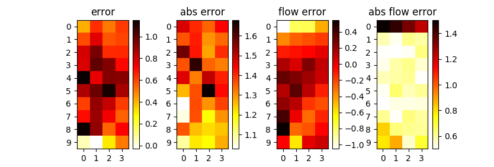
> > 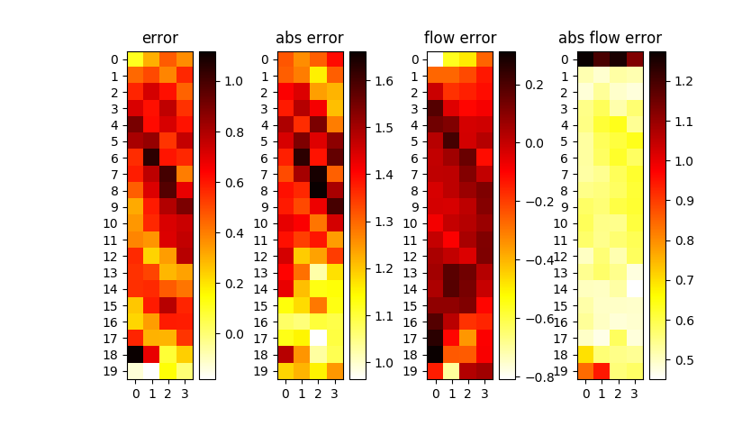
> > 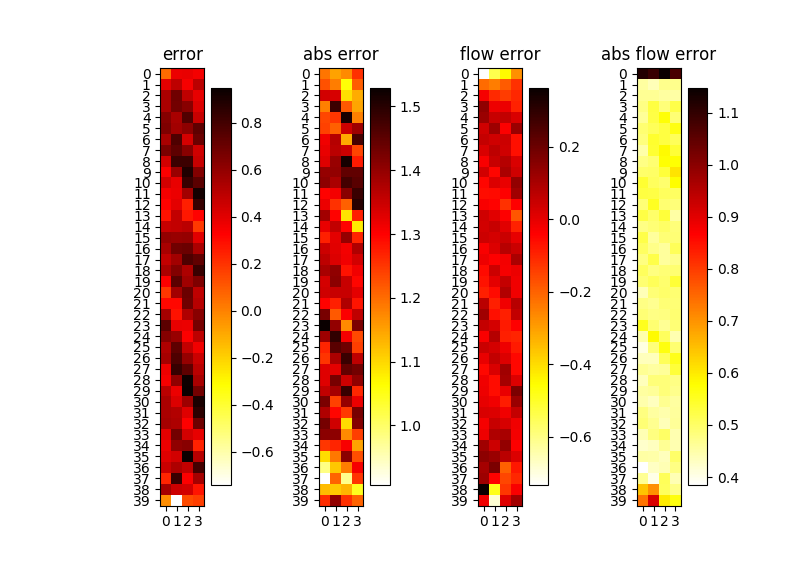
> * 今天试验几个不同的训练方式：
> > * 降低flow_loss直到0
> > * 增加额外一项专门检验最后一个bucket误差的损失项
> > * 损失函数不采用mes采用mape
> > * 更换优化器
> * 好多人用显卡……好慢
> * 16:05 正在训练flow_loss_weight降低的模型，感觉flow_loss_weight会让训练的结果变差？？这个有点迷，另外还是小batch可以取得明显好的效果……不知道为什么

> ## 8-28
> 哎……今天半价烧烤吃不到了
> * 昨天训练的把flow降到0的模型整体上的测试误差减少了，但是forward的误差增大了一些，无可避免的flow loss比之前差了一些，看来之前的损失函数有问题，现在的想法是这样，目前整体上在损失函数上动一下手脚，多试几种损失函数看一看是不是会好一些
> > 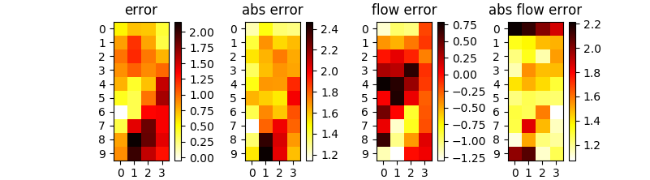
> > 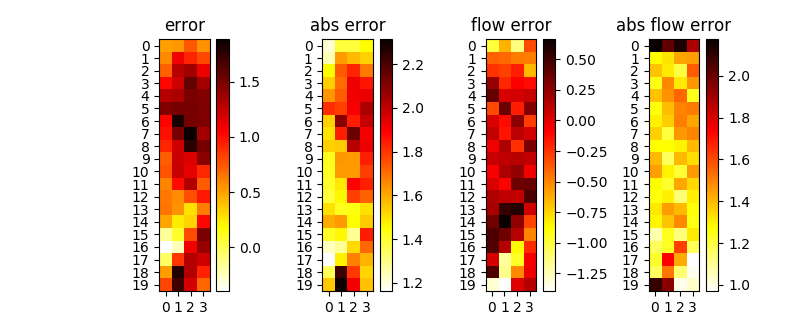
> > 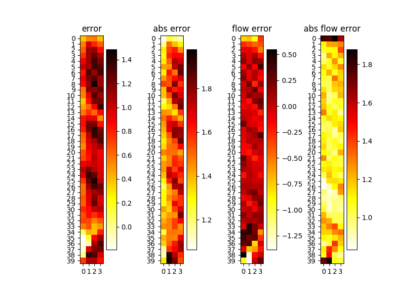
> > 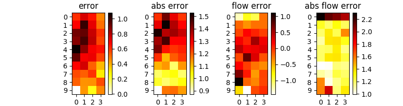
> > 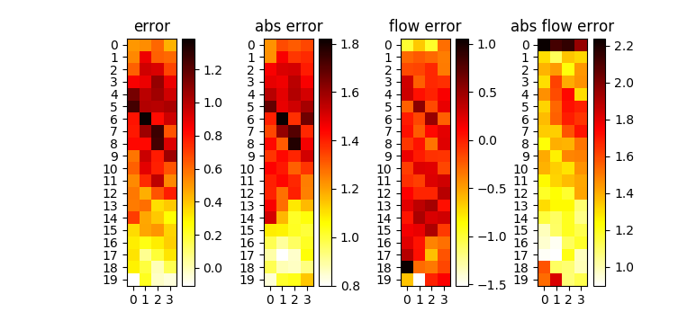
> > 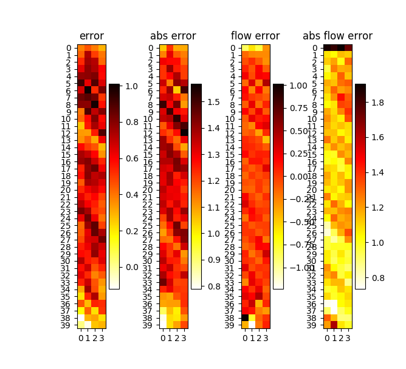
> * 损失函数换成smoothl1之后看着训练过程中的输出会好一些，明天可以看一下最终的可视化结果怎么样，另外可以准备一下其他不同构造的损失函数的设计

> ## 8-29
> * 昨天把损失函数换成smoothl1之后结果略好一些：
> > 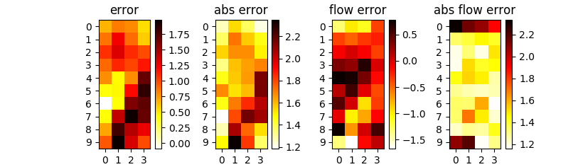
> > 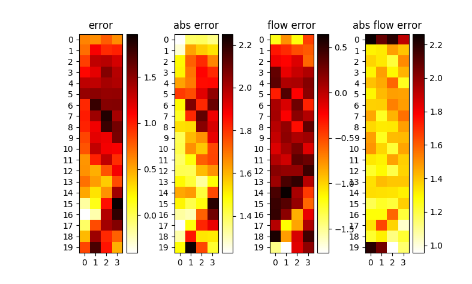
> > 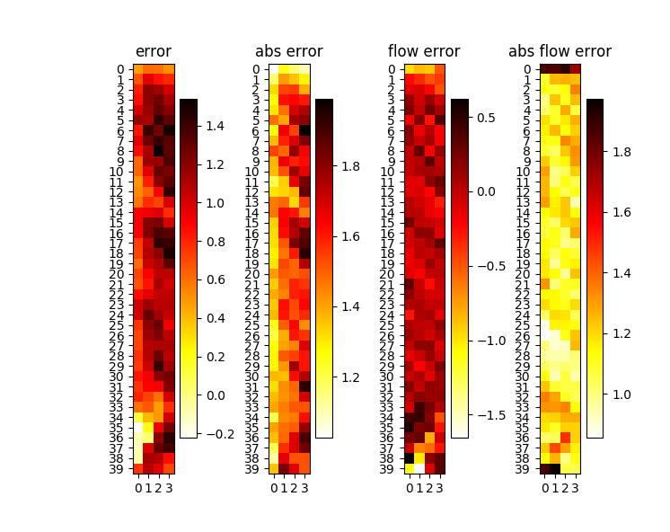
> > 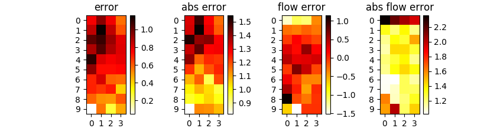
> > 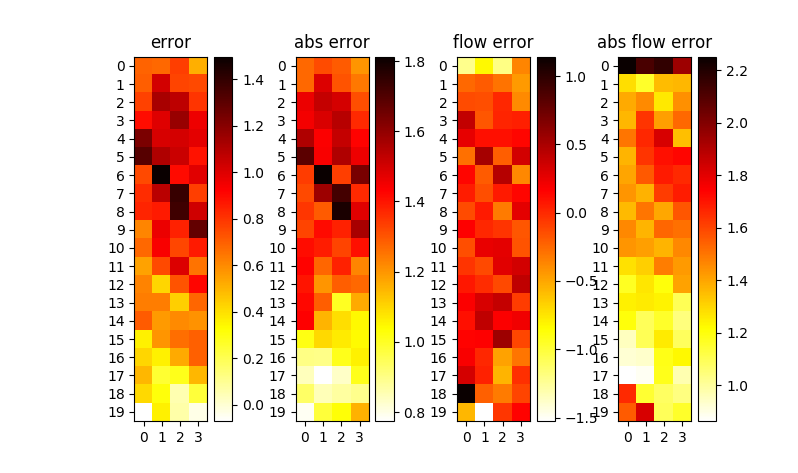
> > 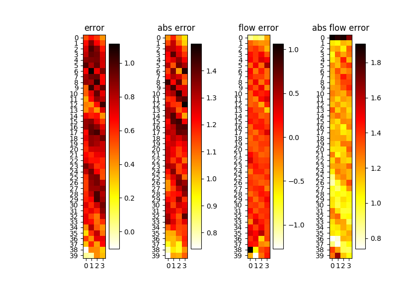
> * 今天还尝试了新的损失函数，不过结果很差，还比不上baseline的模式，就不贴图了，现在尝试一下hidden state的修改 明天训练一下不同的seq length的差距

> ## 9-1
> * 上次的有两个主要的问题：第一个是靠近路段末端的预测效果会比较差；第二是整体预测值偏小。上一周集中做了一些数据分析和实验验证：
> > * 针对临近路口出现的预测偏差，重新检查了一下整体的时间序列，之前样本选取的时间约束有一点问题，有一部分时间是可以作为通行的样本使用的，这样拓展了一下输出样本中的多样性：
> > 
> > 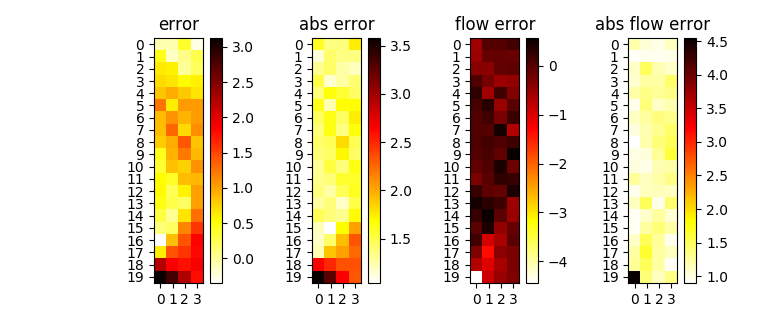
> > 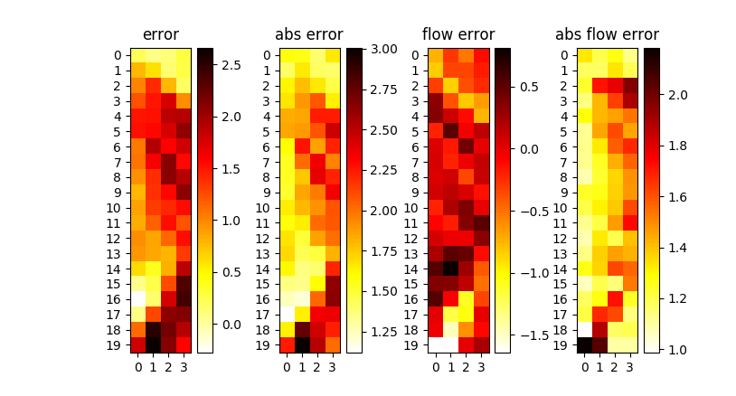
> > * 同时尝试了不采用lanegate的方式进行了训练
> > 
> > * 之后根据对结果的分析，发现整体上flow的误差要远远小于预测值与实际值之间的误差，因此尝试了减少flow损失所占的权重，得到更好的效果：
> > 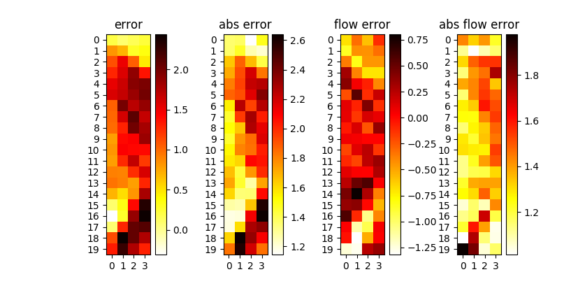
> > 
> > * 随后进行了对损失函数的实验，尝试了额外的两种不同的损失函数，第一种是smoothl1函数，第二中是mape损失函数，得到的效果如下：
> > 
> > 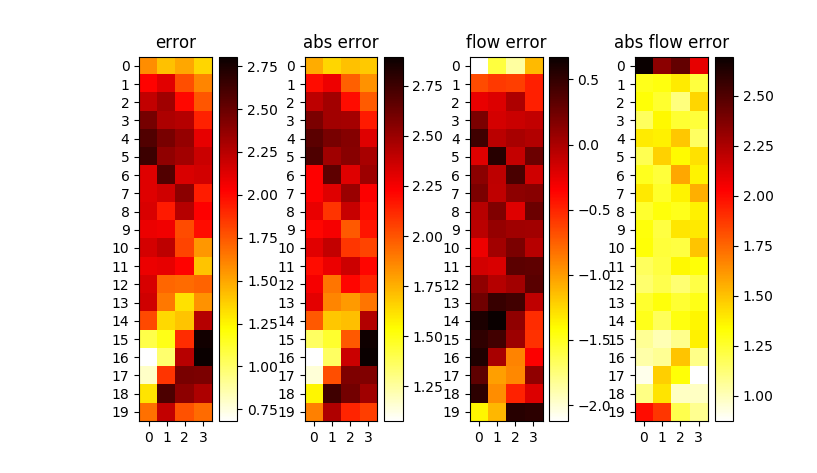
> > * 整体上更换损失函数类型没有特别的改善，另外做了对时间序列长度和网络结构的实验测试：
> > 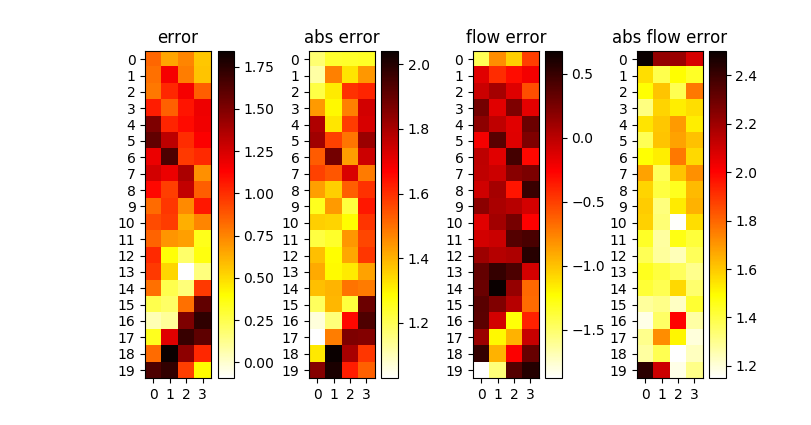
> > 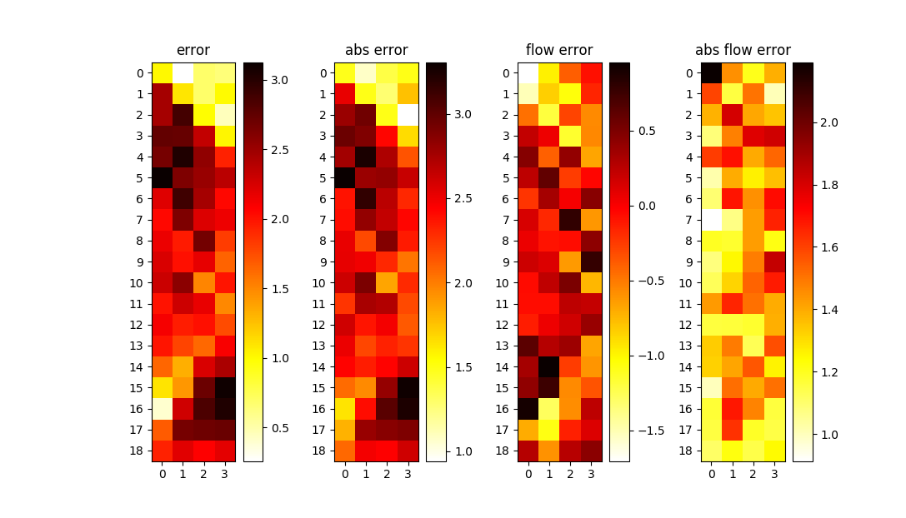
> > 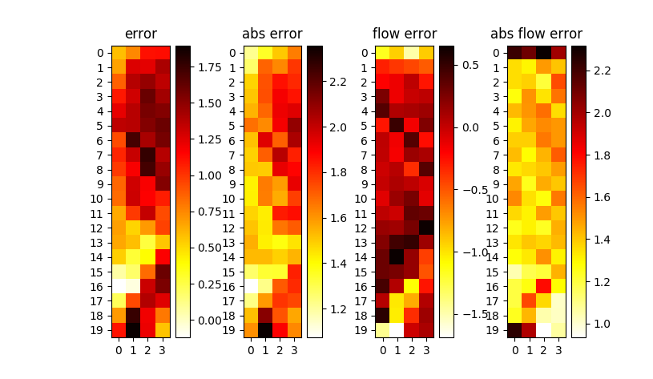
> > * 整体上时间长度的增长不会带来预测结果的改善，反而会因为序列更长导致模型的学习更加困难
> ## 整体上的结果：
> * 通过调整样本选取的原则，去掉flow loss项等方式相比较于之前的baseline有了很大程度上的改善，在路段末尾上误差偏大的问题得到了一定程度上的缓解，相比于路段中其他位置上的误差并没有特别大的差异
> * 损失函数上的修改并不能够使得结果得到更近一步的改善，需要再做仔细的设计
> * 由于每一个小段长度并不长，所以更长的时间序列并不能带来更好的预测效果，这一点上需要再做一些关于更短时间序列的实验，这可以帮助我们将问题重新规范
> * 对模型的预测结果分布做可视化的效果是这样的：
> > 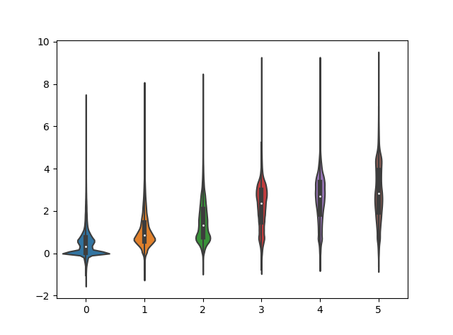
> > 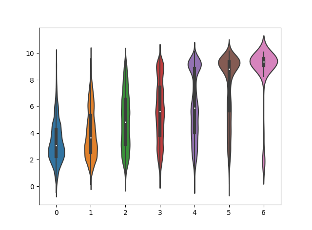
> ## 论文阅读的一点启发
> * 在阅读AAAI 2019年论文 Attention Based Spatial-Temporal Graph Convolutional Networks for Traffic Flow
> 
> * 这篇论文的方法不一定对我们的问题有效，但是他的问题定义与我们十分相似，根据这个方向，查到类似的这一类问题在图神经网络中可以被分类称为动态图问题：在一个图中，图的结构固定，但是随着时间的变化每个节点的输入是变化的。
> * 可以调研一下相关的文章对我们模型的构建可能会有一些帮助
> ## 进一步工作
> * 通过对目前最好结果的模型预测分析可以发现，模型是对中间部分没有较强的分辨能力，接下来的实验需要对模型cell内部做出调整
> * 开始着手构建一个大规模路网，只包含红路灯路口和普通路段，以准备在模型结果足够好的时候直接开始测试
> * 可以调研一下动态图的图网络模型论文

> ## 9-2
> * 上午和毛老师讨论了一下，之后需要注意两个点：
> > * 1.在损失函数和评估指标中需要注重一下两个不同序列之间从整体角度的差异，这一个需要做一些调查在考虑加入什么元素
> > * 2.下一个阶段先不需要构建大规模的路网，对一个简单的路段做一个长时段的仿真

> ## 9-3
> * 整理了GCN的基础理论

> ## 9-4
> * 基本整理了使用GCN做交通预测的三篇文章，从基础理论上讲，不大可能直接利用gcn的理论，不过有两件事需要我们注意一下：
> > * 第一个就是在时序领域也同样可以使用卷积，尤其在我们现在这样不需要考虑太长时间序列的情况下
> > * 第二个就是scheduled sampling这个技术，可以在训练的过程中使用
> * 需要设计一下撤离的程序：
> > * 有红绿灯控制的撤离情况有一些问题，可能需要调整训练模型的数据
> > * 目前先进行没有红绿灯控制的

> ## 9-5
> * cell1 测试结果：
> > 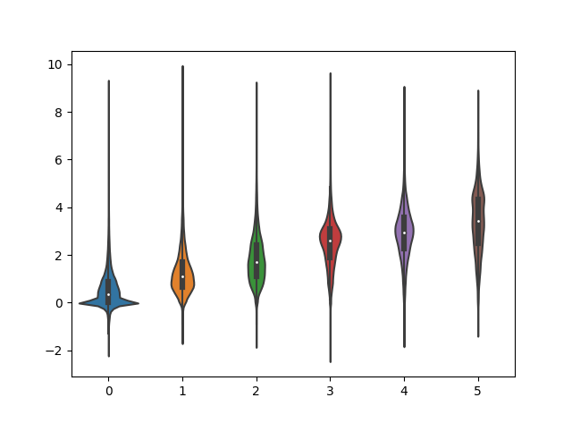
> > 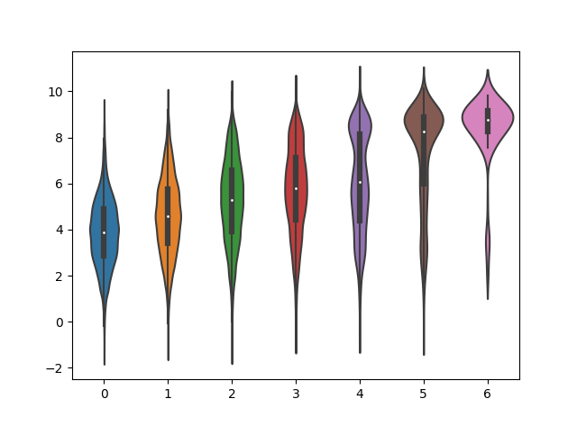
> > 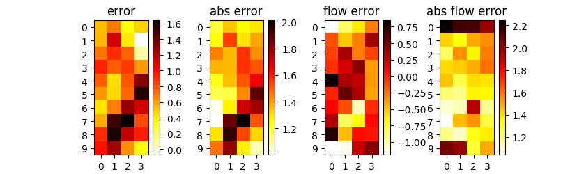
> > 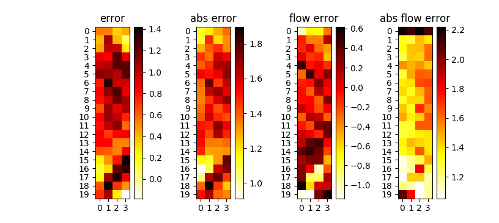

> ## 9-6
> * 遇到一个棘手的问题，贴近真实数据的仿真中要求车辆的速度是以一定概率进行分布的，然而在少车道的情况下一个较慢的车会造成后方大量车辆滞留，这造成了波浪形的交通流出现，这种情况虽然可以通过修改车辆类型中的参数消除掉，波浪形的交通流也正是现实道路交通中会出现的一种交通现象
> * 可以想到的办法是在输入的信息中增加一个当前块的速度信息，然后为了保障整体推演可以进行下去需要在输出模块同样输出流出车辆数与当前块速度
> * 目前分两步走，按照预先设计的结果先把这几个不一样的cell测试完，有机会的话测试一下卷积的结果
> * 21:02 cell2测试结果：
> > 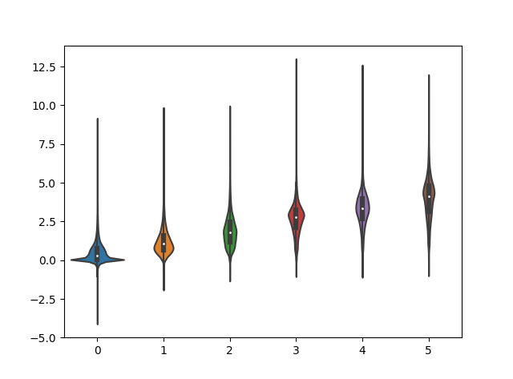
> > 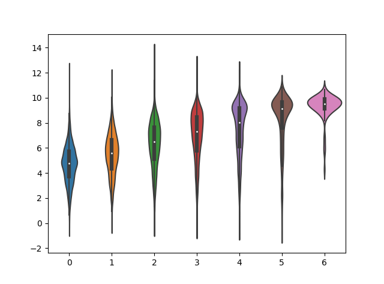
> > 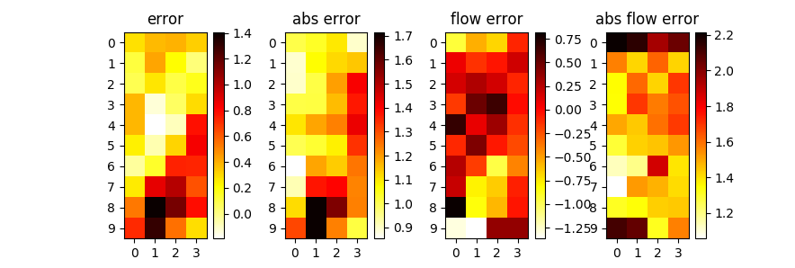
> > 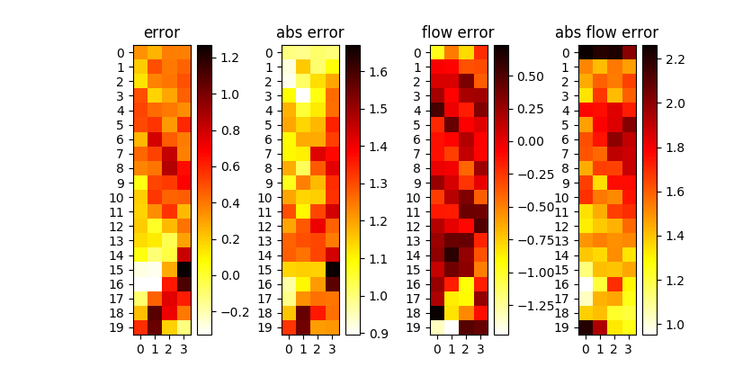

> ## 9-7
> * 按部就班进行cell3的测试
> * 今天想到一个不一样的flow loss的计算方式，通过滑动窗口的方式计算不同窗口下的flow loss：
> \[ \mathcal{L}=\sum_{k=1}^{s-ker+1}(\sum_{i=1}^{ker}\hat{x}_i -\sum_{i=1}^{ker}x_i)^2\]
> * 以ker取3为例，这样对于一个$ \hat{x}_i$ 的梯度从原本的$\frac{\partial \mathcal{L}}{\partial\hat{x}_i}=2(\hat{x}_i-x_i)$转变为了：
> \[\frac{\partial \mathcal{L}}{\partial\hat{x}_i}=2(3\hat{x}_i-3x_i-2(x_{i-1}+x_{i+1})-(x_{i-2}+x_{i+2}))\]
> * 这意味着每个节点的计算需要参考更多节点之间的影响，要与空间上更大范围内的节点之间保持同步

> ## 9-9
> * cell4的测试完成了
> * 整体上cell2的绝对误差最小，相对偏小的情况也最好，预测值也比其他模型更加聚拢，但是对应的flow loss却变得比其他模型大很多：
> 
> > 
> > 
> > 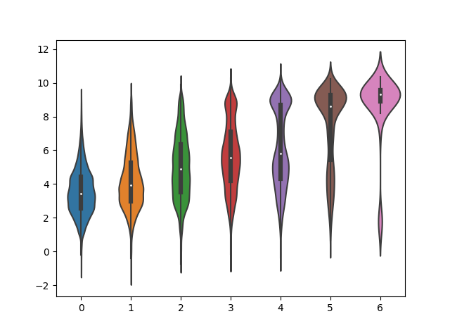
> > 
> * 另外观察了一下数据样本的分布，果然分布及其不均匀，大目标值的数据样本远少于小目标值的样本，这显然是一个造成整体结果偏小的原因，今天添加了对不同目标值的样本增加权重的部分程序，等到晚上进行一下测试
> > 
> * 今天开始写长时间路段预测的程序，不加红绿灯
> * 21:02测试完成人群疏散的代码，明天数据做好之后可以进行测试验证

> ## 9-10
> * 对数据添加了mask的权重之后，预测值偏小的问题变成偏大的问题了：
> > 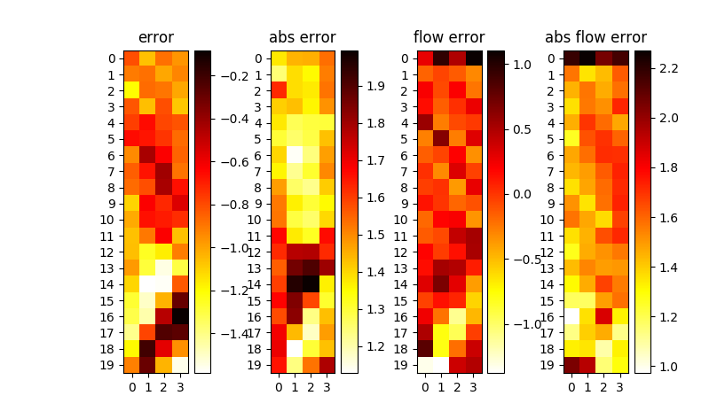
> > 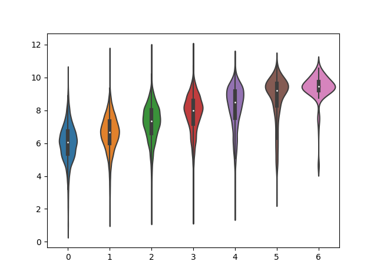
> > 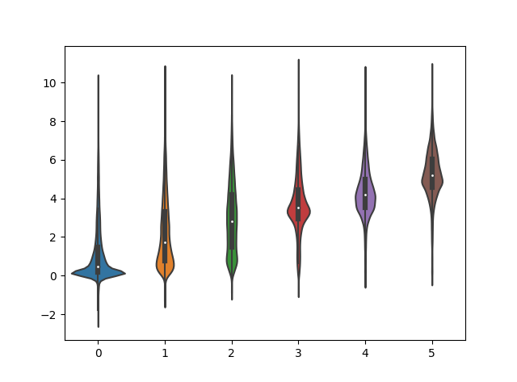
> * 这个说明整体偏小的原因是由于数据分布不均匀所导致的，后面所需的就是根据数据的分布详细设置一下mask的权重，这样就可以进一步改善模型的预测结果
> * 另外整理了一下整体大模型的架构：
> > 
> > 

> ## 9-11
> * 长时间的推演已经完成了，结果有点奇怪，明天要改一改bug

> ## 9-12
> * 就是找不到一个合适的mask，脑壳疼
> * 完了个蛋……找到问题了竟然是一个数据生成的大问题，可能之前训练的东西都不太对……GG
> * 之前训练的模型竟然可以拟合的效果还不错，长时间上整体路段内车辆趋势变化相当贴合，不过可能是因为之前数据生成的bug，在一些局部的区域会产生剧烈的抖动
> > 
> * 添加sample的难点在于infer模式载pytorch的实现下比较难以回传梯度，这部分先不动原本的infer代码，以免出现bug测试不了，额外增加一个train_infer函数
> * 20：12终于梯度可以回传了，不知道训练出来结果怎么样，先攒着吧

> ## 9-16
> * 上次修改过之后的mask还是不能很好地避免过小的问题，准确性还可以，同时测了一下几个不同cell的长时间撤离推演下的结果:
> > 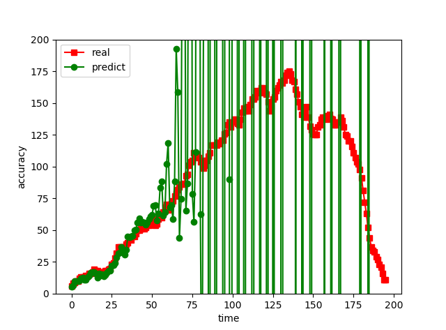
> > 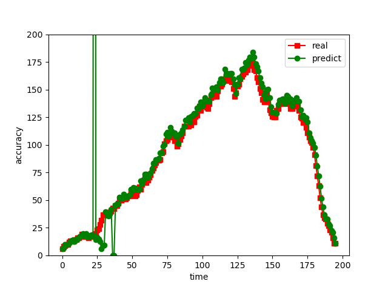
> > 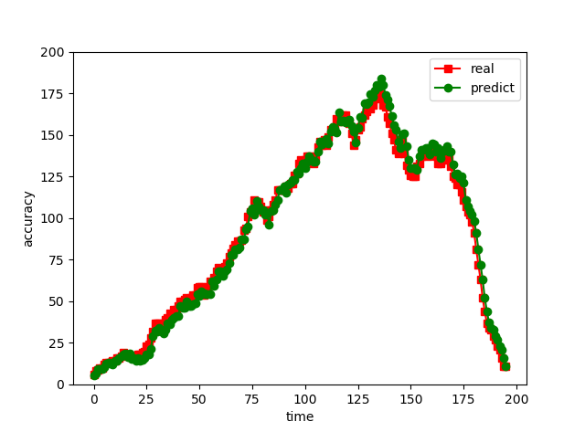
> > 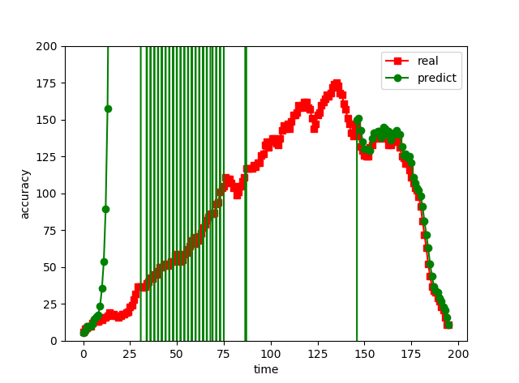
> * 表现最好的是cell3，cell1与cell4都出现了完全失真的抖动，cell在局部出现了剧烈的抖动，但是大多数情况下都可以很好地拟合实际的路段中的存量变化的规律，而cell3在仿真的四种情况下（1500-2000路段 1-2车道数）都没有出现剧烈的抖动情况
> * 另外一点，整体运算速度很快，虽然没有直接的测量，但是整体上感觉会比sumo仿真的结果要快一些

> ## 9-17
> * 今天添加了训练的损失函数按照[9-7](#new_loss)的方法，不过由于pytorch没有提供直接类似的接口，所以使用avgpool1d的方式实现，整体上效果近似，但是反传的梯度会小一些。可以稍晚时候做一些测试
> * scheduled sampling添加了之后训练的时候在服务器上会出现loss为nan的情况，有可能是初始化的问题也有可能是添加的mask之后sum的结果太大
> * 明天需要对evacuation的部分加一些量化的评估指标

> ## 9-18
> * 上午添加了对evacuation的三个量化的评价指标：
> * 可释方差值：$$E(y, \hat{y})=1-\frac{Var\{y-\hat{y}\}}{Var\{y\}}$$
> * 描述了两个序列之间的残差的方差相对于目标值方差之间的关系，取值为1最好，得分越小效果越差
> * R2决定系数：$$R^2(y, \hat{y})=1-\frac{\sum_i(y_i-\hat{y}_i)^2}{\sum_i(y_i-\bar{y})^2}$$描述了两个序列之间的拟合程度，取值为1最好，得分越小效果越差，得分为负表示拟合效果还不如以均值拟合的结果
> * median absolute error 因为cell2会出现剧烈的抖动，所以这里用median值作为评价指标
> * 以下是cell3在时长为20 40 200个时间步长情况下的指标:

||20|40|200|  
|:--:|:--:|:--:|:--:|
|可释方差|0.88|0.96|0.98|
|R2|0.84|0.96|0.98|
|Median|2.12|2.5|3.34|

> * 以下是cell2在时长20 40 200个时间步长的指标

||20|40|200|  
|:--:|:--:|:--:|:--:|
|可释方差|0.64|overflow|overflow|
|R2|0.63|overflow|overflow|
|Median|2.39|2.39|2.69|

> * 总结一下，目前来看，至少在两千米的路段上cell3的拟合能力已经足够好，接下来可以进一步的做一些实验看看有没有进一步的进步，但是整体上需要开始考虑下一步路网的构建
> * 构建路网（目前不考虑红绿灯）所需要的一个关键的部件就是匝道，现在构想的模型输入输出是这样的：
> > 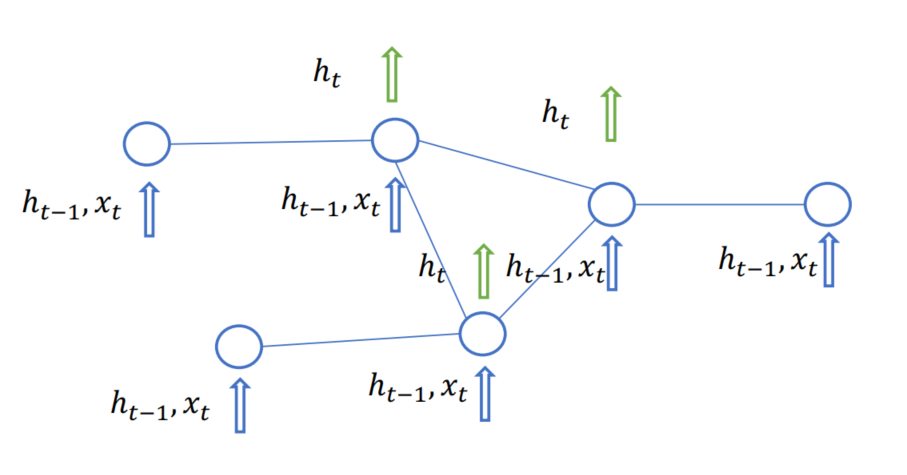
> > * 每一个路口固定成某个固定的图结构，节点$u$在时间$t$对于的输入为$x_t^u=[i_t^u,o^t_u,n_t^u]^T与隐层状态h_{t-1}^u$；输入的是这个图中所有节点的对应输入
> > * 输出是路口相关节点的隐层状态$h_t^u$，不与路口直接相连的节点通过之前所训练的模型进行预测仿真
> > * 为了保证整体仿真的一致性，输出的隐层状态同样应该使用前一阶段的模型中的outputlayer对实际流出量做出预测，在训练阶段需要与前面阶段的模型进行联合训练，以确保两者的隐层状态可以通用

> ## 9-19
> * cell3_sp
> > 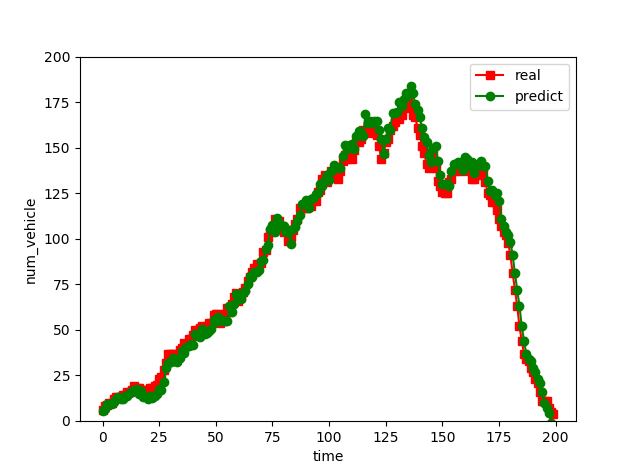

||20|40|200|  
|:--:|:--:|:--:|:--:|
|可释方差|0.88|0.98|0.99|
|R2|0.84|0.98|0.99|
|Median|1.72|1.85|3.78|

> * cell2_sp
> > 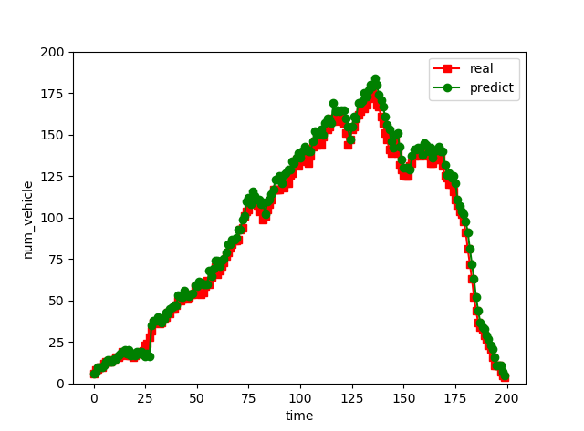

||20|40|200|  
|:--:|:--:|:--:|:--:|
|可释方差|overflow|overflow|0.99|
|R2|overflow|overflow|0.99|
|Median|2.13|2.99|3.02|

> * 和毛老师讨论了一下进一步要做的事情：
> > * 第一个要做的就是做一个热力图，热力图做出来的结果是这样的：
> > 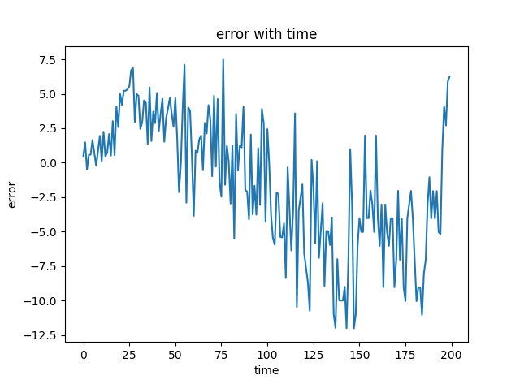
> > 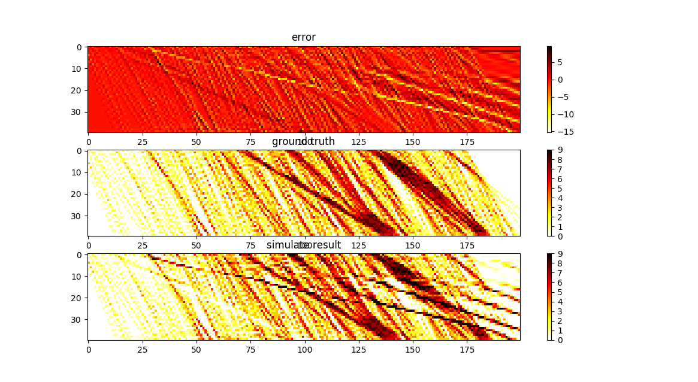
> > * 进一步地加入了新的flow loss的情况下对cell3进行训练，然后再做另外一种结果进行对比
> > * 同时需要做一下路口的拓扑的确定，这个方面比之前想的要复杂一些，这里可能会有主次道路的区分，这一点要根据sumo内部的设计来做相应的不同的拓扑

> ## 9-20
> * 可以看到新加损失函数之后整体上训练速度大概慢了六分之一左右，应该是由于pool操作与反向传播过程带来的
> * 在这里我们做一些简单的数学上面的分析：
> > * 将问题整体简化一下，对于一个机器学习模型$\mathcal{M}$，可以完成从输入到输出的映射，即$x\stackrel{\mathcal{M}}{\rightarrow}\hat{y}$，我们把这个模型造成的误差记做$y-\hat{y}=\mathcal{E}_1(M,x)$  
> > * 我们采用这个模型进行仿真过程就可以描述成$x_0\stackrel{\mathcal{M}}{\rightarrow}\hat{y}_0,\hat{y}_0\stackrel{\mathcal{P}}{\rightarrow}\hat{x}_1; x_1\stackrel{\mathcal{M}}{\rightarrow}\hat{y}_1, \hat{y}_0\stackrel{\mathcal{P}}{\rightarrow}\hat{x}_1;......$这样的过程,其中$\mathcal{P}$是给定的从预测的输出转换成下一个时刻的输入函数，与$\mathcal{M}$无关，因为$\mathcal{P}$是预先根据仿真的条件而给定的，所以我们可以将每个时刻的输入与实际输入产生的误差归结为由于机器学习模型而产生的，记做$x_t-\hat{x}_t=\mathcal{E}_2(\mathcal{M},\hat{x}_{t-1})$
> > * 那么任意时刻的模型预测值与实际之间的误差可以表示成：
> > $$\begin{aligned}
> >   x_t - \hat{x}_t &= \mathcal{E}_2(\mathcal{M},\hat{x}_{t})\\
> >                     &= \mathcal{E}_2(\mathcal{M},x_t+\mathcal{E}_2(\mathcal{M}, \hat{x}_{t-1})) 
> > \end{aligned}$$ 
> > * 这里我们做出一个假设，就是从输出转换到输入的转换函数是严格正确的，而且越接近实际输出值$\hat{y}$，经过转换之后与下一个时刻的实际输入越接近，即若$|\hat{y}-y_t| \leq |\hat{y}'-y_t|$则$|\mathcal{P}(\hat{y})-x_{t+1}|\leq|\mathcal{P}(\hat{y}')-x_{t+1}|$。由于仿真函数是严格正确的，所以我们可以选择比较$\{\hat{x}_t\}与\{x_t\}$之间的差异
> > * 首先我们加一个比较强的条件，就是模型$\mathcal{M}$可以永续的对过程进行模拟，也就是说始终存在一个误差的上界$\epsilon_{upper}$，使得$\forall t,|x_t-\hat{x}_t|\leq\epsilon_{upper}$，在有限的仿真时长里某一个时刻的误差$e_{u}=x_t-\hat{x}_t$，下一个时刻的损失就可以记做：
> > $$e_n=\mathcal{E}_2(\mathcal{M},x_t+e_{u}) $$

> ## 9-23
> * 规范的数学上的分析还是有点困难，今天继续整理一下
> > * 问题还是描述成，对于一个机器学习模型$\mathcal{M}$，可以完成从输入到输出的映射，即$x\stackrel{\mathcal{M}}{\rightarrow}\hat{y}$，另外给定一个从输出到下一个时刻输入的映射函数$\mathcal{P}$，采用这个模型进行仿真过程就可以描述成$x_0\stackrel{\mathcal{M}}{\rightarrow}\hat{y}_0,\hat{y}_0\stackrel{\mathcal{P}}{\rightarrow}\hat{x}_1; x_1\stackrel{\mathcal{M}}{\rightarrow}\hat{y}_1, \hat{y}_0\stackrel{\mathcal{P}}{\rightarrow}\hat{x}_1;......$这样的过程
> > * 因为我们可以假设映射函数$\mathcal{P}$是基于现实世界可以显式表示的规律而确定的（例如在我们仿真的例子中前一阶段的输出就是下一段的输入，bucket内部车辆数等于前一个时刻的车辆数加上流入量减去流出量等）所以整体上造成误差的就是由模型本身带来的，我们关注$\{\hat{y}_t\}$随时间变化的规律
> > $$e_{t}=\hat{y}_t-y_t=\mathcal{E}(\mathcal{P}(y_{t-1}+e_{t-1});\mathcal{M})$$
> > * 这里要降低模型的仿真误差的方式，可以尝试以下的方式调整损失函数：
> > $$\mathcal{Loss}=(\hat{y_t}-y_t)^2 + \gamma ReLU(e_{t-1}(\hat{y}_t-y_t))$$
> > * 损失函数后加的一项只有在现在偏差与之前累积偏差同号时才会有误差值，而且累积偏差值越大，损失就越大。损失函数中这一项在sampling的过程中再加上
> * 另外对比了一下几个不同的实验结果发现：
>   + mask的使用会改善乱流的现象
>   + flow loss的减少也会减少乱流的现象
>   + pool的增加并没有改善效果反而加重了局部的乱流现象

> ## 9-24
> * 昨天工作进展完成了新添加的sim_error部分，同时整理了一下代码，让几个添加的结构：mask、pool、sim_error可以通过命令行参数控制，这样方便对应起来，之前的测试有点乱，重新做测试
> * 今天读了GAT 和Structure-aware convolutional neural network的工作，感觉很有帮助，这两篇要好好整理一下

> ## 9-25
> * 昨天完成了对有mask和有pool的对比，这里先只放出来热力图的对比，差异比较明显：
> * 这是cell作为baseline，什么额外的参数都没有改变的结果：
> 
> * 这是将flow loss的比重调至0的结果：
> 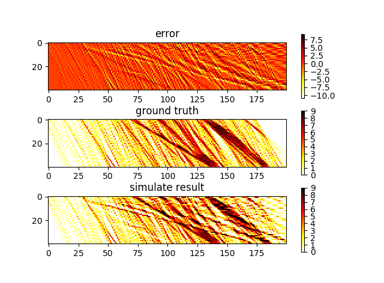
> * 这是加入了mask的结果：
> 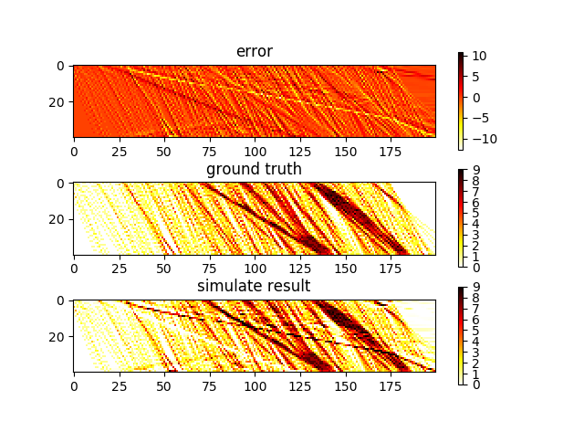
> * 这是加入了[pool](#new_loss)的结果：
> 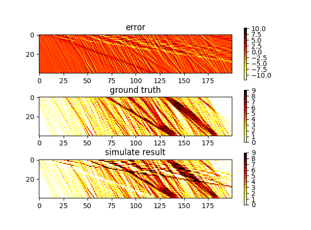
> * ~~考虑一下自定义pytorch中的dataset类，这样可以在训练过程中更有方便一点，之前测试步骤的utilts相关代码先不改~~好像不能改……如果要改的话需要把模型中处理batch和spatial差异的部分也一块改了

> ## 9-26
> * 今天完成了单独添加[sim_error](#sim_error)的测试以及增加了[pool](#new_loss)与mask权重的模型，从热力图上看，sim_error的加入并没有使过慢流的情形减缓，但是从整体路段上的误差来看发生了比较明显的减少,而且和baseline相比显著减少了过慢流的情况：
> * 热力图
> with mask and pool
> 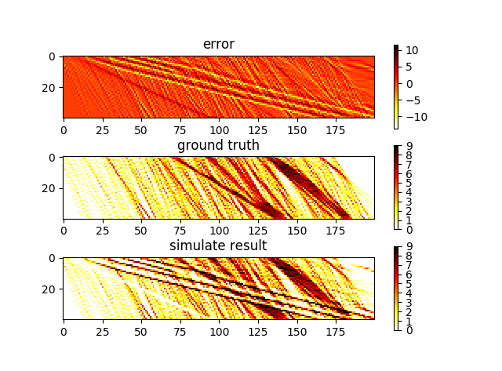
> with sim error
> 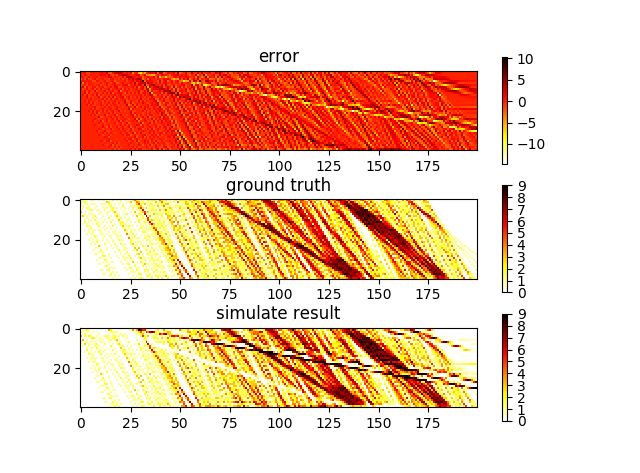
> * 路段损失图
> 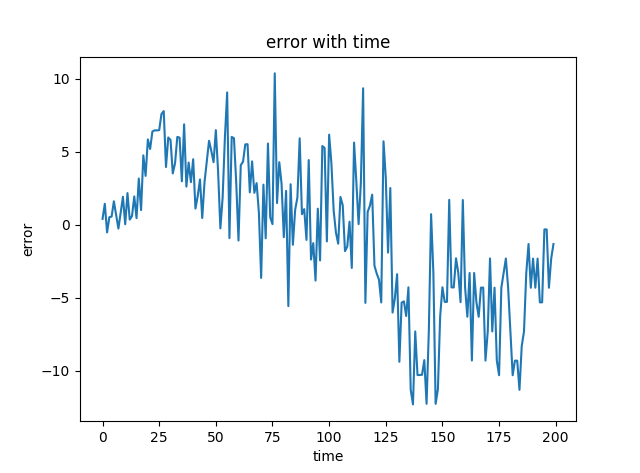
> 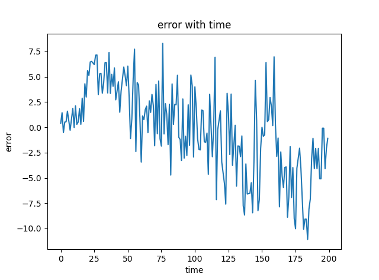

|模型|baseline|with mask|with pool|with simerror|
|:-:|:-:|:-:|:-:|:-:|
|路段损失均值|4.14|3.69|4.46|3.49|
> * 发现一点可以改进的地方，就是在sim error中，可以同样加上mask，不然的话可能和没有加mask的绝对损失相冲突，导致训练损失的动荡。

> ## 9-27
> * 今天完成了添加sim_error和mask，sim_error和pool的测试，结果并不好，目前实验上看似乎只添加mask的仿真效果最好：
> with mask and sim error
> 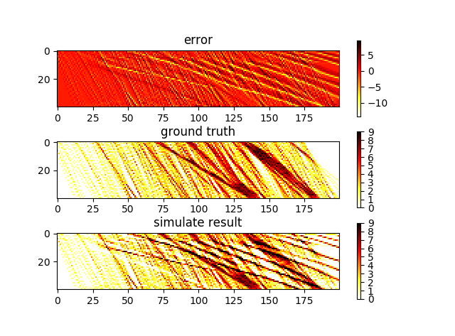
> with pool and sim error
> 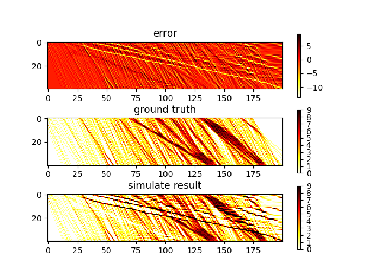

> ## 9-29
> * 昨天做完了全加上的模型结果一如既往并不好：
> with all
> 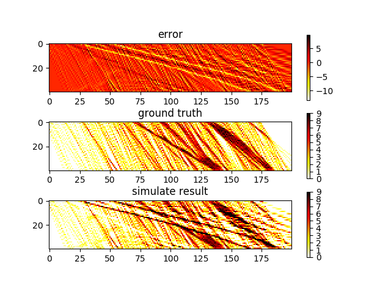
> * 接下来做两个实验，第一个是继续调整mask的权重，可能要想一下要根据一定的概率分布的形式进行数据增强；第二个是新的sim error，之前是根据之前的误差，但是和实际我们想解决的问题有一点差异，我们可以把
>  $$\mathcal{Loss}=(\hat{y_t}-y_t)^2 + \gamma ReLU(e_{t-1}(\hat{y}_t-y_t))$$
> * 中的$e_{t-1}=\hat{y}_{t-1}-y_{t-1}$变为$e_{t-1}=number_{pred}-number_{gt}$，这就是要求当之前累积的预测值是偏小时，下次预测偏小的代价比较大，下次预测偏大的代价比较小.
> * 另外需要看情况做一些新的数据，更多长时段通行的仿真数据用于训练

> ## 10-8
> * 国庆休息结束，现在可以考虑一下接下来的工作内容了
> * 首先是多路段汇聚的情形下的数据生成和处理，这部分需要做的是首先确定数据的组织结构，和代码架构
> * 需要考察一下图卷积的实现，尝试调通一两个现有的模型
> * 然后是红绿灯条件下的模型数据应该怎么实现

> ## 10-9
> * 今天搭出来一个新的仿真场景，在原来的基础上增加两个汇聚的路口，在sumo内，产生竞争的路段有主路段与次路段，之前看上去是转弯让直行，现在仿真的结果看上去是车道少的路段让车道多的路段，不过按照之前和毛老师讨论的结果接下来数据生成的仿真场景就按照默认的设置，下午完成了处理fcd文件的代码，这部分和之前不同的地方有：
> > * 加了一个在路口的bucket，不将这个位置归并到任何一路段中
> > * 不加额外处理路网文件和路线文件的代码，因为我们是从小的局部路网结构生成数据，所以相关的内容提前手动设置好就可以，这样减轻代码的复杂性（虽然增加了手工的工作……）
> > * 没有添加记录speed的文件，这部分以后看情况可能会需要田间
> * 接下来生成样本数据的代码，整体形式上可以考虑一下按照pytorch内部dataloader接口的形式
> * 这里需要仔细设计一下路口之间拓扑的组织形式，这里可能需要参考一下gcn实现

> ## 10-10
> * 今天先写归并时间的代码，然后写加载数据的代码
> * 出问题了……今天写加载数据的代码过程中发现之前的代码中把流入与流出量的位置弄反了，这就导致之前做的实验都不太对了，所以……看情况吧，改了重新训练一下
> * 今天写完了重载的dataset，之后可以用dataloader了，不过每次只能一个文件，需要多次重复

> ## 10-11
> * 昨天跑了修复了数据错位bug的一个模型，添加了mask和simerror效果大概是这样：
> 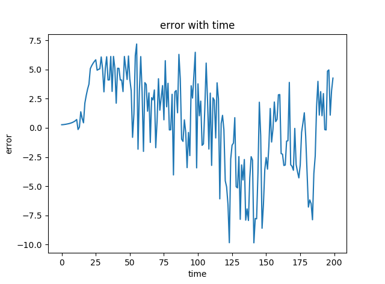
> 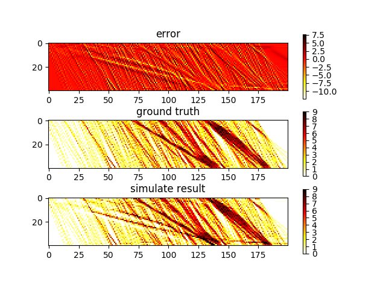
> * 具体效果的好坏需要等今天跑两个单独的模型，再加一个baseline做一下对比看看结果
> * 在新的数据加载代码中加了一个重新加载文件的代码，以应对不同空间大小的数据
> * 接下来着手开始做的第一个拓扑结构是一个两路汇聚的结构，有一个目标路段，两个流出路段，一主一次，另外增加一个中介路段节点，需要考虑一下这个结构应该采取什么样的网络，先用一个拉平的lstm网络做一下base line看一下最差的结果是什么样子，另外明天需要开始做一批数据了，这批数据先不加红绿灯，就正常竞争状态。

> ## 10-12
> * 昨天训练完单独加mask和simerror的模型，结果大概是这样：
> with mask
> 
> with simerror
> 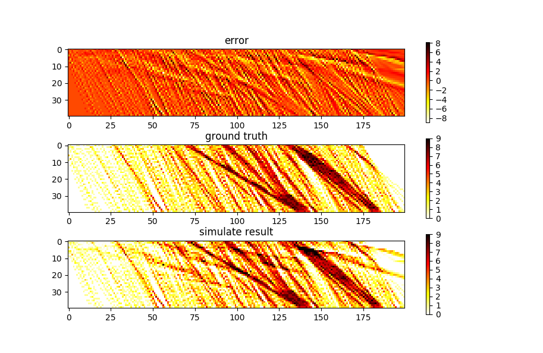
> * 但是比较明显的是sim error的误差更少：
> 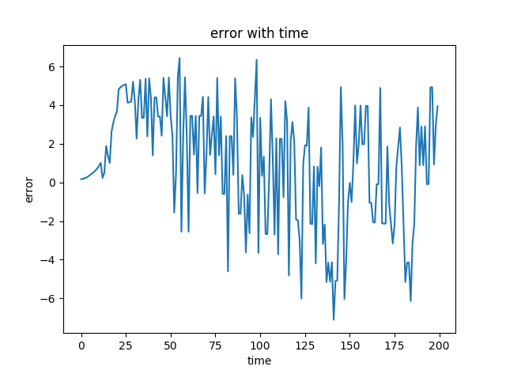
> * 今天遇到一个比较头疼的问题，整个路网的数据结构比较麻烦，是个复合的结构，用两个字典来表示，一个是拓扑结构，预先写定，一层的键值是路口标号，二层的键值是路段的性质（major, minor, inter, end）;另一个是每个路段的数据，键值是每一个路段的标号，对应值是一个包含着这个路段每一时刻每一个小段的输入值的张量
> * 另外确定了整体模型的结构，两个分的基础模型一个是路段的模型，一个是路口的模型，这两个模型分别给出相同维度的隐层变量，同时由同一个全连接层得到实际的输出（这部分可能要根据实际实验结果调整）。这部分今天都已经写完

> ## 10-14
> * 周末训练了加入flow_loss的模型和base_line的模型，结果是这样：
> base line
> 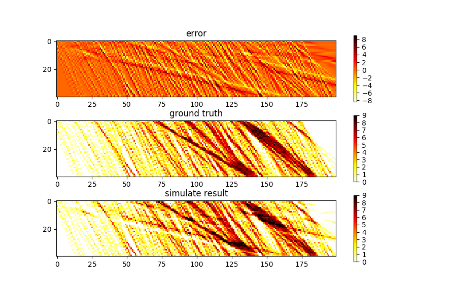
> with flow loss
> 
> * 结果发现flow loss意外的好……，这下最终的模型参数选择上又得多训练一轮来看看结果怎么样了
> * 确定下来，网络模型内部不涉及到任何的网络拓扑结构的处理，输入到网络内部的就是已经完全理顺好网络结构的规整的张量，有四个参数：seg_data, h_seg ，这两个是路段模型中的输入，seg_data(number_buckets, input_size)是这个时刻内所有路段bucket的输入，h_seg是一个列表，四个元素都是(number_buckets, hidden_size)分别表示当前节点的隐层状态，当前节点的细胞状态，前方节点的隐层状态，后方节点的隐层状态；inter_data, h_int，这两个是路口模型的输入，inter_data(n_units, input_size)是这个时刻内每一个路口相关节点的输入，h_int包含两个元素，都是(n_units, hidden_size)分别表示隐层状态和细胞状态

> ## 10-15
> * 今天主要集中精力把周末给王老师汇报的ppt做好，先不推进模型代码部分了
> * 昨天训练的两个模型结果是这样：
> with pool
> 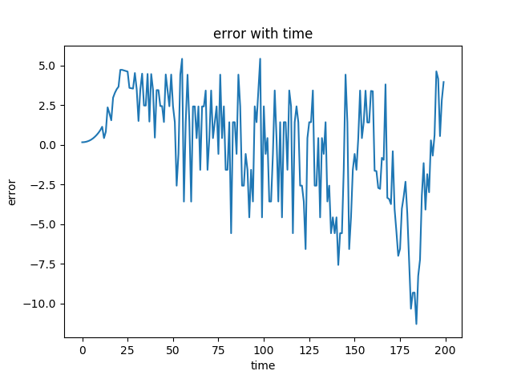
> 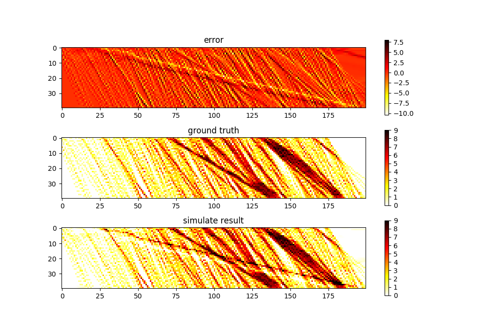
> with all
> 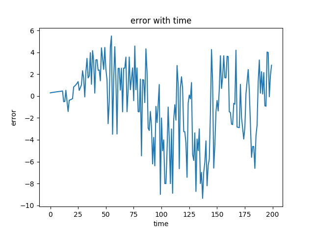
> 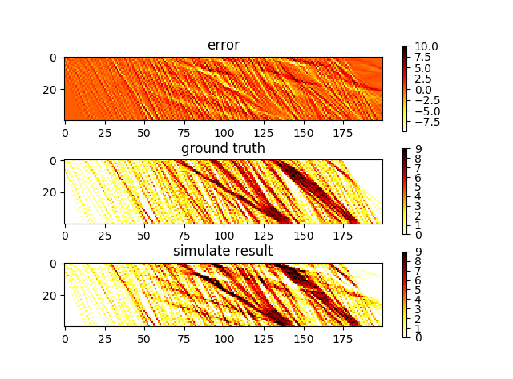
> * 整体上看来不是有越多的技巧就可以效果越好，目前看来是只有flow的效果是最好

> ## 10-16
> * 昨天训练完成了带有flow的混合方法模型，结果如下：
> with flow with sim error:
> 
> with flow with mask:
> 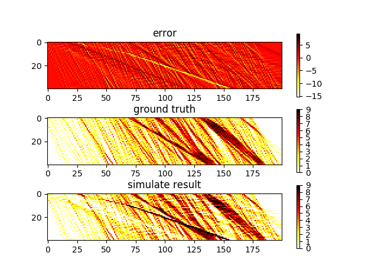

> ## 10-17
> * 昨天训练了单独带有数据增强和所有都带上的模型，结果是这样的：
> with new mask:
> 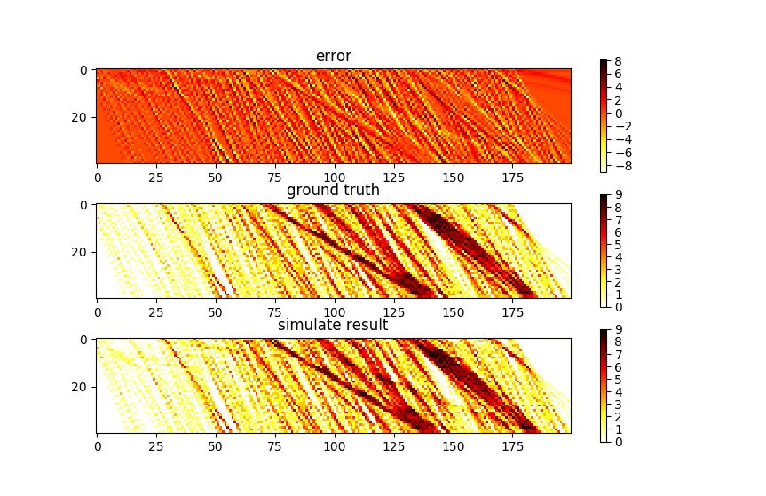
> with new mask flow simerror
> 
> * 目前看来比较好的结果是单独带数据增强的和带flow与sim error的，后者效果更好一些，之后的实验中可以两者交替做尝试
> * 今天是和dataloader搏斗的一天，调整了很久，终于确定了一个可能可以的方案，先尝试一下

> ## 10-21
> * 周末发现simerror好像不太对，改了训练了一下之后好像效果也一般，所以暂时先这样
> * 今天写完模型文件了，现在整个可以得到一个可以正向反向传播的模型，接下来完善一下开始准备数据做实验对比了

> ## 10-22
> * 代码部分比想的写的慢一些，今天完成了训练部分的代码，之后需要完成测试部分的代码，然后做一遍检查

> ## 10-23
> * 今天联合训练的代码写完了，跑着没问题，不知道会不会有隐形的bug，之后需要重新检查一遍，下午开始做数据，现在的想法是200-1000米的中间变长路段，但是需要看辅助这台机器内存够不够，如果不够的话就要缩短时间，然后增加文件数量，同时也需要增加仿真场景

> ## 10-24
> * 程序员节快乐！
> * 今天折腾了一下午，终于保存成功动图了：
> 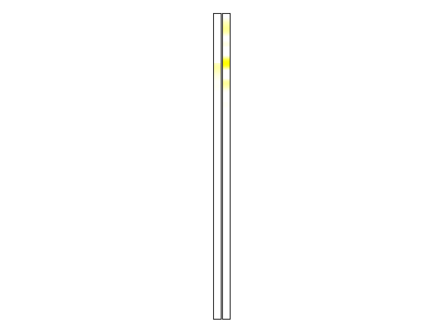
> * 今天数据处理的都差不多了，可以开始训练一个baseline出来了，重写一部分测试的代码，这个需要考虑一下